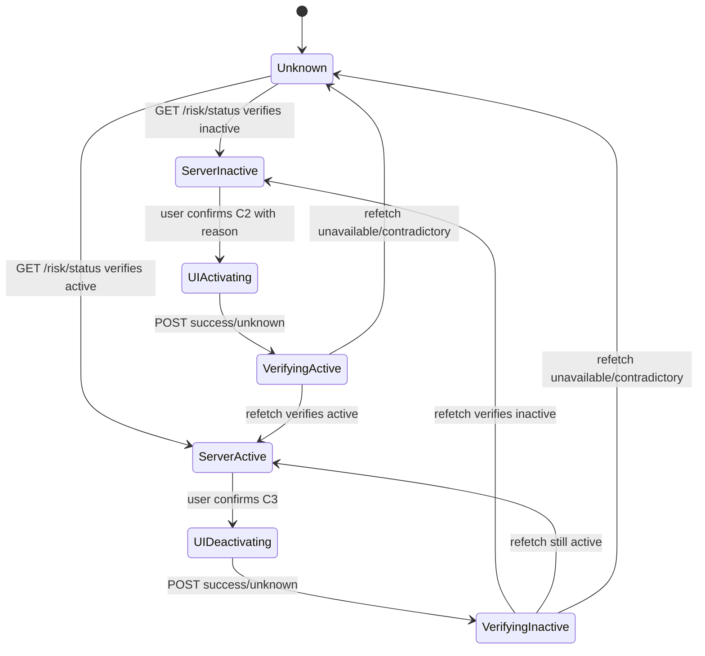
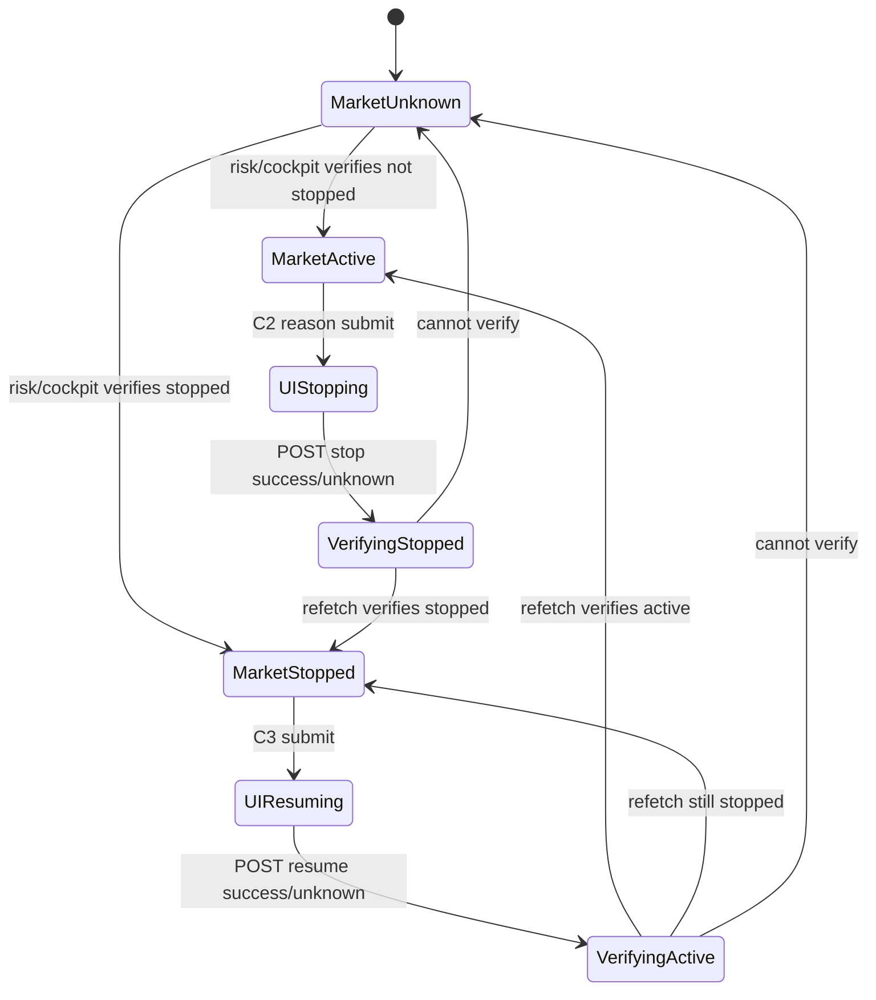
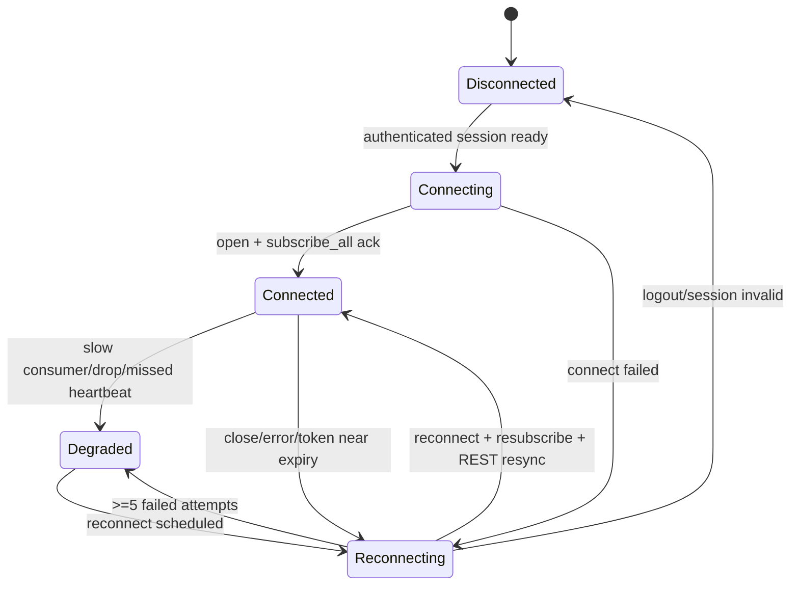
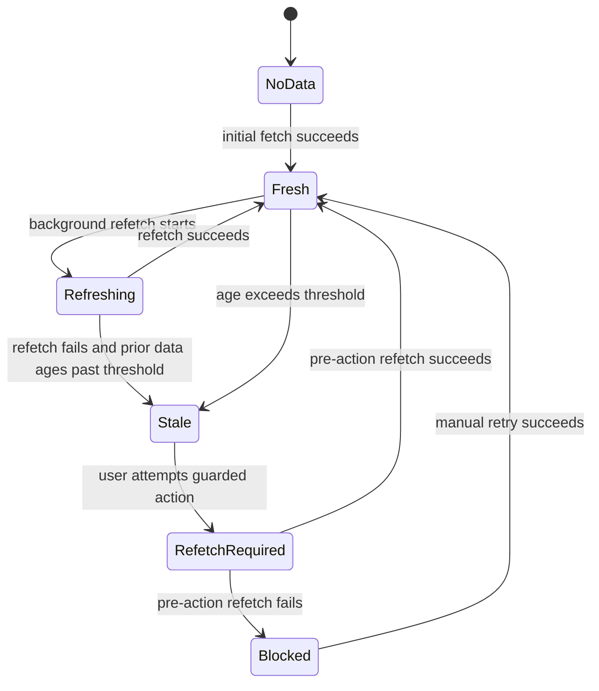

# Frontend Interaction and Operational Safety Specification

Source inputs: `docs/frontend-ui-api-brief.md`, `docs/frontend/api-implementation-review.md`, `docs/frontend/02-user-workflows.md`, `docs/frontend/03-information-architecture.md`, `docs/frontend/04-entity-navigation-model.md`, `docs/frontend/05-p0-screen-specifications.md`, `docs/frontend/wireframes/README.md`, and backend handlers for strategies, runs, risk, settings, API keys/auth, automation, Alpaca reconciliation, discovery, backtests, and memories.

Labels:

- **Confirmed**: visible in reviewed backend or existing frontend planning docs.
- **Policy**: frontend safety rule required by this specification.
- **Backend recommendation**: safer behavior needs API/product support.

This document is a specification only. It does not implement application code.

## 1. Safety primitives

### 1.1 Risk levels

| Level | Meaning | Examples |
| --- | --- | --- |
| **L0 Read-only** | No mutation; safe to auto-refresh. | Alpaca verification, list/detail refresh. |
| **L1 Low-impact mutation** | Local/non-trading mutation with reversible or limited effect. | Create paper strategy, create API key, dry-run discovery. |
| **L2 Operational mutation** | Changes scheduling, state, or costs; can affect future automated behavior. | Pause strategy, skip run, automation enable/disable. |
| **L3 Trading/risk mutation** | Can start/stop trading, alter risk protections, or touch broker state. | Manual live run, kill switch, market resume, Alpaca reconcile. |
| **L4 Administrative destructive/secret** | Irreversible, credential-sensitive, or protection-removing action. | Breaker reset with admin key, provider key replacement, strategy/API key/memory deletion. |

### 1.2 Permission vocabulary

The backend currently confirms only these authorization categories:

| Permission | Backend reality | Frontend policy |
| --- | --- | --- |
| **Public** | Auth, selected guest GET observation routes. | Never expose trading controls. |
| **Authenticated** | Most `/api/v1/*` routes accept bearer JWT or API key. | Browser UI uses bearer JWT; do not use API keys for browser session auth. |
| **Admin credential** | `POST /risk/breaker/reset` requires an `X-Admin-Key` header. | Prompt only inside reset dialog; never persist, log, cache, URL-encode, or retain after request. |
| **Role-based operator/admin** | Not implemented. | Display as product intent only; do not pretend enforcement exists. |

Where the action-safety matrix says `Operator`, `Admin`, or `Researcher`, that is a frontend role intent until backend RBAC exists. The actual confirmed permission is usually `Authenticated`.

**Ship gate:** live/risk/admin mutations should remain disabled in production until backend-scoped RBAC or equivalent step-up authorization exists. The frontend feature flag is a safety catch, not an authorization boundary.

**API key browser rule:** API keys are for programmatic access and account management only. The browser UI must not authenticate normal app REST or WebSocket sessions with `X-API-Key` or `?api_key=`. Browser WebSocket auth currently uses `?token=` because the platform cannot send arbitrary headers; deployment must keep access-token TTL short, avoid logging full WebSocket URLs, and prefer a future short-lived WS ticket endpoint.

### 1.3 Global mutation rules

1. Mutations are **never automatically retried** unless the backend adds idempotency guarantees.
2. Critical risk actions must not treat a successful HTTP response as final truth. The UI must refetch server state and verify the resulting state.
3. WebSocket events may update visible context, but must not be the sole source for enabling high-risk actions because event `data` is untyped.
4. Browser offline state blocks all mutations.
5. Critical actions are blocked when primary entity/risk data is stale and cannot be refreshed.
6. Optimistic UI is allowed only for low-risk visual affordances; never for risk/trading/credential/destructive actions.
7. Every mutation control must have single-flight duplicate-submission prevention.
8. A completed action should link to evidence: affected entity, refreshed state, event log, or audit log when available.

## 2. Confirmation levels

| Level | Name | Requirements | Applies when |
| --- | --- | --- | --- |
| **C0** | Immediate action | No dialog; button may execute after local validation. | Read-only verification, harmless form reset, opening detail views. |
| **C1** | Standard confirmation | Dialog with entity/action summary, environment/mode, consequence, Cancel and Confirm. | L1/L2 non-live mutation or reversible scheduling state. |
| **C2** | Reason-required confirmation | C1 plus non-empty reason field. Reason is sent only if endpoint accepts it; otherwise keep it in local incident note if implemented. | Activating protections, stopping markets, risky operational interventions where accountability matters. |
| **C3** | High-risk live-operation confirmation | C1/C2 plus live-mode warning, fresh server-state check, typed confirmation token, no optimistic UI, no retry. | Live manual run, resume protections/trading, Alpaca reconcile in live broker mode, live strategy edit. |
| **C4** | Administrative credential confirmation | C3 plus one-request admin credential field. Credential is held only in memory for the request and cleared on all outcomes. | Circuit breaker reset while backend requires `X-Admin-Key`. |

Typed confirmation tokens should be short and context-specific, for example `RUN`, `DELETE`, `LIVE`, `RESET`, or the strategy name/id for destructive actions. Do not require users to type secrets or full provider/API keys.

Backend note: `X-Admin-Key` is currently a static shared secret, not a true one-time credential. The frontend must treat each prompt entry as single-use locally, but this does not prevent replay if the secret leaks.

## 3. Action-safety matrix

Legend:

- **Mode**: `P` paper, `L` live. `Allowed` means frontend may expose the action after all guards pass.
- **Stale**: whether stale primary state blocks action.
- **WS**: effect of WebSocket disconnection.
- **Opt**: optimistic UI permitted.
- **Retry**: automatic retry permitted.
- **Dedupe**: duplicate-submission prevention.
- **Verify/invalidate**: minimum query invalidation and server-state verification after mutation.

| Action | Endpoint | Risk | Required permission | P | L | Confirm | Reason | Typed | Admin cred | Stale | WS | Opt | Retry | Dedupe | Success feedback | Failure feedback | Verify / invalidate | Audit implications |
| --- | --- | --- | --- | --- | --- | --- | --- | --- | --- | --- | --- | --- | --- | --- | --- | --- | --- | --- |
| Create strategy | `POST /strategies` | L1 paper, L3 live | Authenticated; Operator intent | Allowed | Allowed only if live mutations flag enabled | C1 paper; C3 live | Optional | Live only | No | Block if settings/broker context stale for live | Disconnected allowed for paper; live requires REST freshness and WS warning acknowledgement | No | No | Disable submit; client request UUID local-only | Toast + navigate to new strategy | Inline validation; preserve form | Invalidate `/strategies`; fetch `/strategies/{id}`; verify `is_paper`, status, config summary | No audit log currently visible in handler; recommend backend audit |
| Edit strategy | `PUT /strategies/{id}` | L2 paper, L3 live | Authenticated; Operator intent | Allowed | Allowed only if live mutations flag enabled | C1 paper; C3 live if live or changing to live | Optional | Live or changing identity/status | No | Block until entity refetched; if dirty and server changed, require merge/reload | WS disconnected allowed only after REST refetch; live shows degraded warning | No | No | Disable save; lock form while in flight | Toast + stay on detail/edit with refreshed version | Inline validation/conflict; preserve user input | Invalidate/fetch strategy, strategies list, runs/events if status/config affects behavior | Recommend audit with before/after diff and actor |
| Run strategy manually | `POST /strategies/{id}/run` | L2 paper, L3 live | Authenticated; Operator intent | Allowed | Allowed only if live mutations flag enabled | C1 paper; C3 live | Recommended; backend does not accept | Live yes | No | Block if strategy/risk/settings stale | If disconnected, block live; paper may proceed with REST warning | No | No | Disable run button until accepted and refetched | `Run accepted`; link to runs filtered by strategy; wait for run/event | 501 runner not configured; conflict/validation visible | Refetch strategy; invalidate `/runs?strategy_id`, `/runs?status=running`, events; poll until new run appears or timeout | Handler writes `strategy.manual_run`; reason not captured |
| Pause strategy | `POST /strategies/{id}/pause` | L2 paper, L2/L3 live | Authenticated; Operator intent | Allowed | Allowed | C1; C2 during incident | Optional | No | No | Block if strategy stale | Allowed with REST freshness; show realtime degraded | No | No | Disable action per strategy | Status shows paused after refetch | Conflict explains current status changed | Refetch strategy; invalidate strategy list, active runs, events | Handler writes `strategy.paused` |
| Resume strategy | `POST /strategies/{id}/resume` | L2 paper, L3 live | Authenticated; Operator intent | Allowed | Allowed only if live mutations flag enabled | C1 paper; C3 live | Recommended; backend does not accept | Live yes | No | Block if strategy/risk/settings stale | Block live if WS disconnected; paper may proceed with warning | No | No | Disable action per strategy | Status shows active after refetch | Conflict explains current status changed | Refetch strategy, risk status, active runs; invalidate list/events | Handler writes `strategy.resumed`; reason not captured |
| Skip next run | `POST /strategies/{id}/skip-next` | L2 | Authenticated; Operator intent | Allowed | Allowed | C1 | Optional | No | No | Block if strategy stale | Allowed with REST freshness | No | No | Disable until refetch shows `skip_next_run=true` | Banner says next scheduled run skipped | Conflict if strategy not active | Refetch strategy; invalidate strategy list/events | Handler writes `strategy.skip_next` |
| Delete strategy | `DELETE /strategies/{id}` | L4 | Authenticated; Operator/Admin intent | Allowed | Allowed only if live mutations flag enabled | C3 | Required by policy; backend does not accept | Yes (`DELETE`) | No | Block if strategy/runs stale; warn if active/running | WS disconnected allowed only after REST confirms no active run or user acknowledges unknown | No | No | Disable delete; route guard prevents double dialog | Navigate to strategies; tombstone toast | 404 as already gone; other errors blocking | Invalidate strategies, strategy detail, runs/events/reports linked | No audit log currently visible; backend audit recommended |
| Cancel pipeline run | `POST /runs/{id}/cancel` | L2 paper, L3 live/unknown | Authenticated; Operator intent | Allowed | Allowed | C1 paper/unknown; C3 live if strategy known live | Optional | Live yes | No | Block if run state stale or not running | If disconnected, allow only after REST run refetch; warn updates may lag | No | No | Disable per run; show cancelling state | Run status cancelled after verification | Bad request/service error shown; state refetched | Refetch run; invalidate runs list, active runs, events, orders/trades if linked | Backend audit not visible; recommend audit |
| Activate global kill switch | `POST /risk/killswitch {active:true,reason}` | L3 protection-adding | Authenticated; Operator intent | Allowed | Allowed | C2 | Yes, sent | No | No | Block if risk status cannot be fetched unless emergency override is product-approved | WS disconnected does not block if REST reachable; show realtime degraded | No | No | Disable global control; one active request | Critical banner `Kill switch active` only after refetch verifies | If validation/server error, keep unsafe banner and reason field | Refetch `/risk/status`, `/risk/cockpit`, `/risk/breakers`; invalidate cockpit; wait briefly for relevant WS/event if connected | Handler writes `kill_switch.activated` with reason |
| Deactivate global kill switch | `POST /risk/killswitch {active:false}` | L3 protection-removing | Authenticated; Operator/Admin intent | Allowed | Allowed only if live mutations flag enabled | C3 | Required by policy; backend does not accept | Yes (`LIVE` or `DEACTIVATE`) | No | Block if risk/breakers/health stale | Block live if WS disconnected; paper may require REST-only warning | No | No | Disable global control | Banner clears only after `/risk/status` verifies inactive | Failure keeps kill switch active in UI until verified otherwise | Refetch risk status/cockpit/breakers, cockpit, active runs | Handler writes `kill_switch.deactivated`; reason not captured |
| Stop a market | `POST /risk/market/{type}/stop` | L3 protection-adding | Authenticated; Operator intent | Allowed | Allowed | C2 | Yes, sent | No | No | Block if market/risk state cannot be fetched unless emergency override approved | WS disconnected does not block if REST reachable | No | No | Disable market control | Market shows stopped after refetch | Validation/server error inline | Refetch risk status/cockpit/breakers; invalidate cockpit/strategies for market filter | Handler writes `market_kill_switch.activated` with reason |
| Resume a market | `POST /risk/market/{type}/resume` | L3 protection-removing | Authenticated; Operator/Admin intent | Allowed | Allowed only if live mutations flag enabled | C3 | Required by policy; backend does not accept | Yes (`RESUME`) | No | Block if risk/breaker/market data stale | Block live if WS disconnected | No | No | Disable market control | Market shows active after refetch | Failure keeps market stopped/unknown | Refetch risk status/cockpit/breakers, cockpit, affected strategies/runs | Handler writes `market_kill_switch.deactivated`; reason not captured |
| Reset circuit breaker | `POST /risk/breaker/reset` + `X-Admin-Key` | L4 protection reset | Authenticated + admin key header | Allowed | Allowed only if live mutations flag enabled | C4 | Required by policy; backend only accepts scope | Yes (`RESET`) | Yes | Block if breaker list/risk stale | Block if WS disconnected in live; require REST freshness | No | No | Disable reset; clear key on settle | Breaker absent/reset only after refetch verifies | 401 inline; 503 not configured; clear admin key | Refetch `/risk/breakers`, `/risk/status`, `/risk/cockpit`; invalidate cockpit | No audit log visible in handler; backend audit strongly recommended; never persist key |
| Create API key | `POST /api-keys` | L4 secret creation | Authenticated; Admin intent | Allowed | Allowed | C1 | Optional | No | No | Does not depend on stale trading state | WS irrelevant | No | No | Disable submit; prevent repeated key creation | Show plaintext key once with copy and download warning | Validation/server error; never show partial key unless response exists | Invalidate `/api-keys`; verify metadata appears; plaintext not cached beyond dialog | Handler writes `api_key.created` |
| Revoke API key | `DELETE /api-keys/{id}` | L4 access removal | Authenticated; Admin intent | Allowed | Allowed | C3 | Recommended; backend does not accept | Yes (`REVOKE`) | No | Block if key list stale; refetch key row before dialog | WS irrelevant | No | No | Disable per key | Key row shows revoked/removed after list refetch | 404 as already revoked/missing; otherwise error | Invalidate/list `/api-keys`; verify key absent or `revoked_at` set | Handler writes `api_key.revoked` |
| Replace an LLM provider key | `PUT /settings` | L4 secret replacement | Authenticated; Admin intent | Allowed | Allowed | C3 | Recommended | Yes (`REPLACE`) | No | Block if settings stale; refetch before save | WS irrelevant | No | No | Disable save; keep secret only in form memory | Provider shows configured + last4 after refetch; clear input | Validation/server error; do not repopulate secret from failed request logs | Refetch `/settings`; verify `api_key_configured`/`last4`; invalidate provider-dependent panels | Backend settings update not visibly audited; recommend audit. Secrets never persisted in browser |
| Change risk settings | `PUT /settings` | L3/L4 | Authenticated; Admin intent | Allowed | Allowed only if live mutations flag enabled | C3 | Required by policy; backend does not accept | Yes (`RISK`) | No | Block if settings/risk stale | Block live if WS disconnected; paper may proceed with REST warning | No | No | Disable save | Settings and risk summary reflect new thresholds after refetch | Validation error inline; preserve form | Refetch `/settings`, `/risk/status`, `/risk/cockpit`, `/risk/breakers`; invalidate cockpit | Backend settings update not visibly audited; audit recommended |
| Run an automation job | `POST /automation/jobs/{name}/run` | L2 or L3 if job can trade/reconcile | Authenticated; Admin intent | Allowed | Allowed; C3 if job has broker/live effect | C1 normal; C3 live/broker jobs | Recommended | Live/broker yes | No | Block if automation status stale | WS irrelevant; use REST polling | No | No | Disable per job until status/health refresh | Job status triggered/running after refresh | 400/503 shown; no retry | Refetch automation status/health/runs; poll job until state changes or timeout | No audit visible; recommend audit and job run id |
| Enable/disable automation job | `POST /automation/jobs/{name}/enable` | L2/L3 | Authenticated; Admin intent | Allowed | Allowed; C3 for enabling live-effect jobs | C1 disable; C3 enable live-effect | Recommended | Enable live-effect yes | No | Block if automation status stale | WS irrelevant | No | No | Disable toggle until verified | Toggle reflects enabled state after status refetch | 400/503 inline; revert visual state from server | Refetch automation status/health; invalidate cockpit automation card | No audit visible; recommend audit |
| Verify Alpaca reconciliation | `GET /automation/alpaca/verify` | L0 | Authenticated; Admin intent | Allowed | Allowed | C0 | No | No | No | Does not block on stale, but result itself must show timestamp | WS irrelevant | N/A | GET retry allowed manually/normal query policy | Disable duplicate verify while in flight | Verification report displayed with mode labels | 503/502 as not configured/provider error | Invalidate only verification query; no mutation verification needed | No mutation; no audit required |
| Execute Alpaca reconciliation | `POST /automation/alpaca/reconcile` | L3/L4 broker state | Authenticated; Admin intent | Allowed | Allowed only if live mutations flag enabled | C2 paper; C3 live | Required by policy; backend does not accept | Live yes (`RECONCILE`) | No | Block if settings broker mode or prior verify stale; require verify first | WS irrelevant; use REST verification | No | No | Disable reconcile; require new verify after attempt | Summary + post-reconcile verification displayed; status `verified` only if report agrees | 502/503 shown; require manual verify before retry | Refetch verification, automation runs/health, portfolio/orders/trades if affected | No audit visible; backend audit strongly recommended |
| Start discovery | `POST /discovery/run` | L1 dry-run, L2 deploying candidates/cost | Authenticated; Researcher/Admin intent | Allowed | Allowed if no live deployment; block live-deploy ambiguity until backend clarifies | C1 dry-run; C2 non-dry-run | Non-dry-run yes | No | No | Block if form/settings stale enough to make provider mode unknown | WS irrelevant; synchronous REST | No | No | Disable start; show long-running state with cancel only as client abort warning | Result displayed and history refetched | Timeout unknown state; show check history | Invalidate `/discovery/results`; if timeout, poll results before allowing retry | No audit visible; recommend run id + audit |
| Start a backtest | `POST /backtests/configs/{id}/run` | L1/L2 compute/research | Authenticated; Researcher intent | Allowed | Allowed; no broker effect expected | C1 | Optional | No | No | Block if config stale | WS irrelevant | No | No | Disable run for config | New backtest run detail after refetch | 400/404/422 inline | Refetch config, `/backtests/runs?backtest_config_id`, run detail | Backend audit unknown; lower priority |
| Delete a memory | `DELETE /memories/{id}` | L4 destructive knowledge loss | Authenticated; Researcher/Admin intent | Allowed | Allowed | C3 | Recommended; backend does not accept | Yes (`DELETE`) | No | Block if memory row/list stale | WS irrelevant | No | No | Disable delete per row | Row removed after list refetch | 404 as already gone; otherwise error | Invalidate `/memories`/search query; verify row absent | No audit visible; recommend audit |

## 4. Paper-versus-live behavior

### 4.1 Required labels

The shell and every confirmation dialog for an operational action must display:

- `Environment: {environment}` from `/settings.system.environment`.
- `Schema: {schema_status} {current_schema_version}/{required_schema_version}` where available.
- `Broker: {name} ({Paper|Live}, {Configured|Not configured})` for relevant broker contexts.
- `Strategy mode: {Paper|Live}` when `strategy.is_paper` is known.
- `Data freshness: last verified {timestamp} ({age})` for risk/entity state.

Live labels use explicit text, not color alone: **LIVE BROKER** and **LIVE STRATEGY**.

### 4.2 Dialog wording differences

Paper dialogs say: `This affects paper-mode execution only, based on the currently loaded strategy/broker state.`

Live dialogs say: `LIVE OPERATION. This may affect real trading, broker state, or production risk protections. Verify the environment, broker, and strategy mode before confirming.`

If mode cannot be determined, use the live-strength path: `Mode is unknown. Treat this as live until refreshed state proves otherwise.`

### 4.3 Stronger live confirmation

Live actions require C3 when they can start/resume trading, remove protections, reconcile broker state, change live strategy behavior, or change risk limits. C3 requires typed confirmation and a fresh pre-submit refetch.

### 4.4 Frontend feature flag

Add a frontend configuration flag such as `VITE_ENABLE_LIVE_MUTATIONS=false` by default for deployments that should observe live data but not mutate live state. Keep this disabled for production live/risk/admin controls until backend RBAC/step-up auth and idempotency support exist. When disabled:

- Hide or disable live mutation buttons.
- Explain `Live mutations are disabled by frontend configuration.`
- Still allow read-only live verification screens.
- Do not use the flag as a security boundary; backend authorization must still enforce real permissions.

### 4.5 Visibility during confirmation

Confirmation dialogs must keep environment and mode visible in the dialog header and near the final confirm button. Scrolling dialog content must not hide the mode banner.

## 5. Mutation-state behavior

### 5.1 Pending state

- Enter a local `confirming -> submitting -> verifying -> settled` sequence for guarded actions.
- During `submitting`, disable confirm/cancel only if cancelling cannot abort the request; otherwise Cancel changes to `Close after request completes`.
- During `verifying`, show `Request accepted. Verifying server state...` for critical actions.

### 5.2 Button disabling and duplicate-click prevention

- Disable the exact action button while its mutation is in flight.
- For entity-scoped actions, disable sibling controls that conflict with the pending state, for example pause/resume/run/delete on the same strategy.
- Use a local single-flight key: `{endpoint}:{entityId}:{action}`.
- Do not rely only on disabled CSS; the mutation function must reject duplicate in-flight calls.

### 5.3 Network timeout

Timeout on a mutation creates **unknown completion state**, not failure, if the request may have reached the server.

UI response:

1. Stop showing the spinner as if still submitted.
2. Show `Completion unknown. Checking server state...`.
3. Refetch relevant state with backoff.
4. Keep the action disabled until verification determines completed, not completed, or still unknown.
5. Do not auto-resubmit.

### 5.4 Unknown completion state

Unknown completion state applies to timeouts, browser tab suspension, lost network after submit, 502/503 from gateways where upstream may have acted, and aborted client connections for asynchronous operations.

The UI must show one of:

- **Verified completed**: refreshed state matches intended result.
- **Verified not completed**: refreshed state clearly contradicts the intended result.
- **Still unknown**: state cannot be fetched or payload does not expose enough evidence. Manual retry is allowed only after explicit user acknowledgement and only for idempotent or safe-to-repeat actions.

### 5.5 Conflict response

On `ERR_CONFLICT` or status-precondition failure:

- Close or keep the dialog in a non-submitting state.
- Refetch the entity.
- Explain `Server state changed before this action completed.`
- Recompute action availability from the refreshed state.

### 5.6 Validation response

- Field errors stay inside forms/dialogs.
- Backend validation text is preserved verbatim in a technical details area, with user-friendly summary above it.
- Do not clear user input except one-time credentials/secrets if security requires clearing.

### 5.7 Unauthorized response

- For bearer auth: refresh once, then retry only safe GETs. Do **not** automatically replay mutations after refresh unless the request was never sent.
- For breaker reset admin key: show invalid admin credential inline and clear the key field.
- If session refresh fails, clear session and redirect with safe `next`.

### 5.8 Server error

- Preserve the pre-action UI state unless verification proves otherwise.
- For critical mutations, immediately refetch relevant state before displaying final failure.
- Present not-configured `501`/selected `503` as feature unavailable, not as a crash.

### 5.9 Successful response followed by contradictory refreshed state

For critical actions, server verification wins over mutation response.

If HTTP success says active/inactive/accepted but refreshed state contradicts it:

1. Show `Action response received, but refreshed server state does not match.`
2. Mark the control as degraded/unknown.
3. Keep the safer interpretation: protections active/stopped if uncertainty is about resuming; unsafe/degraded if uncertainty is about activating protection.
4. Offer manual refresh and audit/event links.
5. Recommend incident escalation for live operations.

## 6. Risk state machines

Diagrams distinguish durable **server state** from transient **UI state**.

### 6.1 Global kill switch



Server states: `ServerActive`, `ServerInactive`, `Unknown`. UI transient states: `UIActivating`, `UIDeactivating`, `VerifyingActive`, `VerifyingInactive`.

### 6.2 Per-market stop/resume



Resume is protection-removing and must fail closed: if verification is unavailable, display stopped/unknown rather than active.

### 6.3 Circuit breaker

```mermaid
stateDiagram-v2
  [*] --> BreakerUnknown
  BreakerUnknown --> NotTripped: /risk/breakers excludes scope
  BreakerUnknown --> Tripped: /risk/breakers includes scope
  Tripped --> UIResetPrompt: user opens reset
  UIResetPrompt --> UIResetSubmitting: C4 with X-Admin-Key header
  UIResetSubmitting --> VerifyingReset: POST success/unknown; clear key
  UIResetSubmitting --> Tripped: 401/validation; clear key
  VerifyingReset --> NotTripped: refetch excludes scope
  VerifyingReset --> Tripped: refetch still includes scope
  VerifyingReset --> BreakerUnknown: cannot verify
```



`X-Admin-Key` exists only during `UIResetSubmitting` and is cleared before any transition out.

### 6.4 WebSocket connection



WS connection is never authoritative for permission to mutate. After reconnect, visible entity/risk queries must refetch before high-risk controls are enabled.

### 6.5 Stale data



Freshness thresholds:

- Risk status/cockpit/breakers: 15 seconds for live actions, 30 seconds for paper.
- Strategy/run primary entity: 30 seconds for live actions, 60 seconds for paper.
- Settings/broker mode: 60 seconds before live mutations.
- Automation/Alpaca verification: require explicit fresh verify before reconcile; recommended max age 60 seconds.

These freshness checks are frontend safeguards only. They do not prevent cross-client races unless the backend adds version/ETag preconditions.

### 6.6 Authenticated session refresh

```mermaid
stateDiagram-v2
  [*] --> Anonymous
  Anonymous --> AuthenticatedFresh: login succeeds
  AuthenticatedFresh --> RefreshDue: access token expires within 60s
  RefreshDue --> Refreshing: POST /auth/refresh
  Refreshing --> AuthenticatedFresh: refresh succeeds; reopen WS if needed
  Refreshing --> SessionExpired: refresh fails
  AuthenticatedFresh --> Refreshing: 401 on GET triggers refresh-once
  AuthenticatedFresh --> Mutation401: 401 on mutation
  Mutation401 --> SessionExpired: do not auto-replay mutation; require login
  SessionExpired --> Anonymous: clear tokens and redirect
```



Mutations that receive `401` must not be silently replayed because the request may have partially completed or because the user may no longer be authorized.

## 7. Safe copy templates

Use placeholders exactly; do not invent entity values.

### 7.1 Standard confirmation

Title: `Confirm {action}`

Body: `You are about to {action} {entity_type} {entity_label}. Environment: {environment}. Mode: {mode}. Last verified: {last_verified_at}.`

Primary button: `{action_label}`

Secondary button: `Cancel`

### 7.2 Reason-required confirmation

Title: `Reason required: {action}`

Body: `{action} changes operational safety state for {scope}. Enter a short reason for audit and incident review.`

Reason label: `Reason`

Reason placeholder: `Example: {incident_or_observation}`

Validation: `A reason is required before this action can continue.`

### 7.3 High-risk live operation

Title: `LIVE OPERATION: {action}`

Body: `This may affect live trading, broker state, or production risk protections. Verify the environment and mode before continuing.`

Context block:

```text
Environment: {environment}
Broker: {broker_name} ({broker_mode})
Strategy: {strategy_label} ({strategy_mode})
Risk state: {risk_state}
Last verified: {last_verified_at}
```

Typed confirmation label: `Type {confirmation_token} to continue.`

Primary button: `Confirm live {action}`

### 7.4 Administrative credential

Title: `Administrative credential required`

Body: `Resetting a circuit breaker removes a protection state. Enter the admin credential for this request only.`

Credential label: `Admin credential`

Credential helper: `This value is sent as X-Admin-Key for this request only. It is not stored.`

Failure: `Admin credential was rejected. The value has been cleared.`

### 7.5 Unknown completion

Title: `Completion unknown`

Body: `{action} may or may not have reached the server. Do not repeat it until refreshed server state is checked.`

Primary button: `Check server state`

Secondary button: `Close`

### 7.6 Contradictory verification

Title: `Server state does not match the action response`

Body: `The request returned successfully, but refreshed server state for {entity_label} is {actual_state}, not {expected_state}. Treat this as degraded until investigated.`

Primary button: `Refresh again`

Secondary link: `Open audit/events`

### 7.7 Live mutations disabled

Title: `Live mutation disabled`

Body: `This deployment is configured to observe live state but not change it from the frontend. Use an approved operational path for {action}.`

## 8. Server-state verification policy

| Action family | Mutation success is verified by | If verification fails |
| --- | --- | --- |
| Strategy create/edit/delete | `GET /strategies`, `GET /strategies/{id}` or 404/list absence | Keep form/detail degraded; do not assume save/delete completed. |
| Strategy run | New/updated `/runs?strategy_id={id}` or relevant event after REST polling | Show accepted-but-unverified; do not submit another run automatically. |
| Strategy pause/resume/skip | `GET /strategies/{id}` fields match expected status/skip flag | Show conflict/unknown and recompute actions. |
| Run cancel | `GET /runs/{id}` status indicates cancelled/non-running, or service exposes cancellation state | Show cancellation unknown; keep active run visible until proven otherwise. |
| Kill switch / market controls | `/risk/status`, `/risk/cockpit`, `/risk/breakers` reflect intended protection state | Use safer display: stopped/active protection or unknown/degraded. |
| Breaker reset | `/risk/breakers` no longer includes scope and `/risk/status` is fresh | Keep breaker tripped/unknown; require admin credential again for any retry. |
| API keys | `/api-keys` list reflects created/revoked metadata | For create, never recover plaintext from cache; for revoke, keep row as unknown. |
| Settings/provider/risk | `GET /settings` redacted fields/settings match expected; risk endpoints refreshed for risk settings | Show settings saved response as unverified; block dependent live actions. |
| Automation | `/automation/status`, `/automation/health`, `/automation/runs` reflect job change/run | Show triggered/unverified; no automatic rerun. |
| Alpaca reconcile | Fresh `GET /automation/alpaca/verify` after reconcile | Treat broker state as unknown; require manual verify. |
| Discovery/backtest | History/detail endpoints show a new run/result, or synchronous response is displayed with saved history refetch | Warn user before repeating. |
| Memory delete | `/memories` or active search no longer returns row | Keep row with `delete unverified` state. |

## 9. Actions that remain unsafe or ambiguous

1. Backend has no role model; frontend role labels cannot enforce Operator/Admin/Researcher permissions. Any authenticated bearer token or API key can reach most high-risk endpoints today.
2. `X-Admin-Key` is a static shared secret, not a true one-time credential; a leaked value can be replayed indefinitely and breaker reset lacks visible audit logging.
3. No idempotency-key support exists for live/trading/broker mutations.
4. Several critical endpoints do not accept or persist `reason` even when frontend policy requires one for accountability.
5. Strategy delete, settings update, run cancel, automation actions, memory delete, breaker reset, and Alpaca reconcile do not visibly write audit logs in reviewed handlers.
6. `POST /strategies/{id}/run` is asynchronous and returns only accepted status; there is no operation id to correlate acceptance to the created run, so duplicate live runs remain possible after timeout/tab duplication.
7. `POST /discovery/run` is synchronous and potentially long-running; timeout creates unknown completion without a job id.
8. Market type and breaker reset scope vocabularies are not strongly confirmed in the risk handlers.
9. Settings provider key semantics for omitted vs empty string are subtle; frontend must avoid accidentally clearing keys. Full-object settings saves make normal form serialization risky.
10. WebSocket event payloads are untyped; they cannot safely drive mutation eligibility.
11. Browser CORS defaults may block `X-Admin-Key`, `X-API-Key`, or `PATCH` unless deployment config is updated. Adding those headers while keeping wildcard origins would broaden exposure risk.
12. Paper/live mode can be known for strategies and broker settings, but some runs/actions may not expose enough mode context directly. Automation job live-effect capability is not modeled.
13. Alpaca reconciliation effect is backend-defined and not represented as a typed frontend-safe dry-run/plan/apply flow.
14. Refresh tokens appear stateless/reusable until expiry in reviewed source; changing password does not visibly revoke sessions.

## 10. Backend changes recommended for safer frontend behavior

1. Add RBAC/permissions for operator, researcher, admin, and break-glass actions; stop relying on frontend intent labels. Do not ship live/risk/admin mutations from the frontend before this exists.
2. Add idempotency keys and server-side duplicate suppression for all mutating endpoints, especially live runs, risk controls, automation, discovery, backtests, API key creation, and Alpaca reconciliation.
3. Add `reason` fields to protection-removing and operational actions: kill switch deactivate, market resume, strategy pause/resume/run/skip/delete, run cancel, settings/risk changes, automation enable/run, API key revoke, memory delete.
4. Audit every high-risk/destructive/secret mutation with actor, entity, mode, request id, reason, and before/after summary.
5. Return operation IDs for asynchronous or long-running actions: manual strategy run, discovery run, automation job run, Alpaca reconcile, backtest run.
6. Provide stable DTOs/OpenAPI schemas for domain structs, risk status/cockpit, automation, Alpaca verify/reconcile, discovery, backtests, memories, and WebSocket event `data` by type.
7. Add explicit paper/live mode to run, automation, and reconciliation responses where broker/strategy mode matters.
8. Add preflight/preview endpoints for Alpaca reconciliation and risk/settings changes, with `dry_run` or `plan/apply` semantics.
9. Replace browser-entered static `X-Admin-Key` with role/session-based step-up authentication or single-use server-issued challenges; if the header remains, include CORS allowed header only for trusted origins and audit failures without logging the key.
10. Normalize not-configured errors to `501 ERR_NOT_IMPLEMENTED` or a consistent `503` code with machine-readable feature names.
11. Add version/ETag or `updated_at` precondition support for full-object strategy/settings/backtest updates.
12. Expose canonical enum vocabularies for market type, breaker scope, statuses, order types, and automation jobs.
13. Add short-lived WebSocket tickets so browser clients do not put bearer JWTs or API keys in WebSocket URLs.
14. Add refresh-token rotation/revocation, and revoke active sessions on password changes or credential compromise.

## 11. Files created or changed

- Created `docs/frontend/06-interaction-operational-safety.md`.
