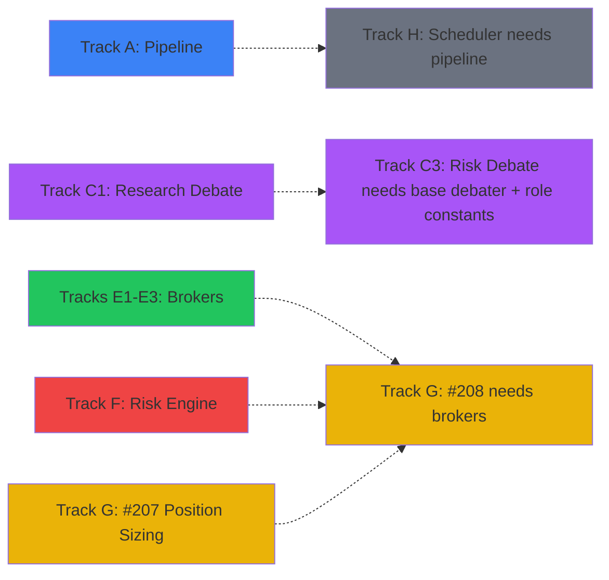

# Phase 3: Execution Paths

> 59 issues across 13 tracks. **25 ready now**, 34 blocked by dependencies.
> Updated: 2026-03-21

## Summary

| Track | Name                   | Total  | Ready  | Blocked | Models   |
| ----- | ---------------------- | :----: | :----: | :-----: | -------- |
| A     | Pipeline Orchestration |   5    |   3    |    2    | Claude Opus 4.6 |
| B     | Analysis Agents        |   9    |   5    |    4    | Mixed    |
| C1    | Research Debate        |   6    |   2    |    4    | Claude Opus 4.6 |
| C2    | Trader Agent           |   1    |   1    |    0    | Claude Opus 4.6 |
| C3    | Risk Debate            |   5    |   0    |    5    | Claude Opus 4.6 |
| D1    | Data Providers         |   12   |   2    |   10    | GPT-5.4  |
| D2    | Technical Indicators   |   4    |   3    |    1    | GPT-5.4  |
| E1    | Alpaca Broker          |   3    |   1    |    2    | GPT-5.4  |
| E2    | Binance Broker         |   2    |   1    |    1    | GPT-5.4  |
| E3    | Paper Broker           |   2    |   1    |    1    | GPT-5.4  |
| F     | Risk Engine            |   3    |   1    |    2    | Claude Opus 4.6 |
| G     | Order Management       |   2    |   1    |    1    | Mixed    |
| H     | Memory & Scheduler     |   4    |   4    |    0    | Mixed    |
|       | **Total**              | **59** | **25** | **34**  |          |

---

## Track F: Risk Engine

> Depends on: Nothing (fully independent)

| #   | Issue                                                               | Title                                                                 | Size | Blocker | Status  | Model    |
| --- | ------------------------------------------------------------------- | --------------------------------------------------------------------- | :--: | ------- | ------- | -------- |
| 1   | [#209](https://github.com/PatrickFanella/get-rich-quick/issues/209) | Implement risk engine: pre-trade validation and position limit checks |  M   | None    | READY   | Claude Opus 4.6 |
| 2   | [#210](https://github.com/PatrickFanella/get-rich-quick/issues/210) | Implement risk engine: circuit breaker state machine                  |  M   | #209    | BLOCKED | Claude Opus 4.6 |
| 3   | [#211](https://github.com/PatrickFanella/get-rich-quick/issues/211) | Implement risk engine: kill switch with three mechanisms              |  S   | #209    | BLOCKED | Claude Opus 4.6 |

**Sequential start:** #209 first, then #210 and #211 can run in parallel.

---

## Track G: Order Management

> Depends on: Track E (brokers) + Track F (risk engine) for #208

| #   | Issue                                                               | Title                                                                     | Size | Blocker | Status  | Model    |
| --- | ------------------------------------------------------------------- | ------------------------------------------------------------------------- | :--: | ------- | ------- | -------- |
| 1   | [#207](https://github.com/PatrickFanella/get-rich-quick/issues/207) | Implement position sizing calculator (ATR-based, Kelly, Fixed Fractional) |  M   | None    | READY   | GPT-5.4  |
| 2   | [#208](https://github.com/PatrickFanella/get-rich-quick/issues/208) | Implement order state machine and lifecycle manager                       |  M   | #207    | BLOCKED | Claude Opus 4.6 |

**Sequential:** #207 first (no deps), #208 after (also needs brokers + risk engine in practice).

---

## Track H: Memory & Scheduler

> Depends on: Track A (pipeline) for scheduler integration

| #   | Issue                                                               | Title                                                                           | Size | Blocker | Status | Model    |
| --- | ------------------------------------------------------------------- | ------------------------------------------------------------------------------- | :--: | ------- | ------ | -------- |
| 1   | [#212](https://github.com/PatrickFanella/get-rich-quick/issues/212) | Implement memory reflection: generate agent memories from trade outcomes        |  M   | None    | READY  | Claude Opus 4.6 |
| 2   | [#213](https://github.com/PatrickFanella/get-rich-quick/issues/213) | Implement memory injector: retrieve and format memories for agent prompts       |  S   | None    | READY  | GPT-5.4  |
| 3   | [#215](https://github.com/PatrickFanella/get-rich-quick/issues/215) | Implement market hours checker for equity trading schedule                      |  XS  | None    | READY  | GPT-5.4  |
| 4   | [#214](https://github.com/PatrickFanella/get-rich-quick/issues/214) | Implement cron scheduler: load strategies and trigger pipeline runs on schedule |  M   | None    | READY  | GPT-5.4  |

**All ready.** No internal dependencies. Can all run in parallel.

---

## Cross-Track Dependencies

---

## Model Selection Guide

Pick the model that fits the task. Any model available in the Copilot coding agent picker is fair game.

### Available Models

| Model | Strengths | Best for |
|-------|-----------|----------|
| **Claude Opus 4.6** | Strongest reasoning, best at complex multi-step logic, excellent system prompt writing | Pipeline orchestration, debate orchestration, state machines, agent implementations with prompts |
| **Claude Sonnet 4.6** | Strong reasoning at faster speed, good code generation | Agent implementations, structured output parsing, risk engine logic, memory reflection |
| **GPT-5.4** | Strong code generation, good at following patterns, reliable | HTTP clients, broker adapters, data providers, position sizing, test writing |
| **GPT-5.4 mini** | Fast, efficient, good for mechanical/repetitive code | Constants, simple structs, utility functions, market hours checker, boilerplate |
| **GPT-5.3-Codex** | Code-specialized, strong at precise implementations | Technical indicators (math-heavy), algorithms, pure computation |
| **Gemini 3 Pro** | Good general purpose, strong at docs/analysis | Documentation tasks, ADRs, research notes |

### Task-to-Model Mapping

| Task type | Recommended model | Why |
|-----------|-------------------|-----|
| Pipeline/debate orchestration | Claude Opus 4.6 | Complex control flow, multiple interacting components |
| System prompts (agent personality) | Claude Opus 4.6 | Needs nuanced writing that shapes LLM behavior |
| Agent struct + Execute + prompt combined | Claude Sonnet 4.6 | Good balance of reasoning + speed for medium complexity |
| Structured output parsing (JSON) | Claude Sonnet 4.6 | Reliable at building robust parsers with edge cases |
| State machines (circuit breaker, orders) | Claude Sonnet 4.6 | State transition logic needs careful reasoning |
| Memory reflection | Claude Sonnet 4.6 | LLM reasoning about trade outcomes |
| Risk engine validation | Claude Sonnet 4.6 | Financial logic needs precision |
| HTTP clients and API adapters | GPT-5.4 | Well-defined patterns, good at REST client code |
| Data provider implementations | GPT-5.4 | Straightforward API integration |
| Broker CRUD methods | GPT-5.4 | Follows established interface patterns |
| Technical indicators (SMA, RSI, etc.) | GPT-5.3-Codex | Math-heavy, algorithm-focused |
| Position sizing formulas | GPT-5.3-Codex | Mathematical precision |
| Rate limiters, utility functions | GPT-5.4 mini | Simple, well-scoped algorithms |
| Constants, type definitions | GPT-5.4 mini | Mechanical, no reasoning needed |
| Market hours checker | GPT-5.4 mini | Simple time logic |
| Cache wiring, chain configuration | GPT-5.4 | Follows existing patterns |
| Cron scheduler | GPT-5.4 | Standard library usage |

---

## Recommended Assignment Order

### Wave 1 (start now — 4 parallel, all independent tracks)

| Issue                                                               | Track        | Model             |
| ------------------------------------------------------------------- | ------------ | ----------------- |
| [#158](https://github.com/PatrickFanella/get-rich-quick/issues/158) | A - Pipeline | Claude Opus 4.6   |
| [#182](https://github.com/PatrickFanella/get-rich-quick/issues/182) | D1 - Data    | GPT-5.4           |
| [#196](https://github.com/PatrickFanella/get-rich-quick/issues/196) | E1 - Alpaca  | GPT-5.4           |
| [#209](https://github.com/PatrickFanella/get-rich-quick/issues/209) | F - Risk     | Claude Sonnet 4.6 |

### Wave 2 (after wave 1 merges)

| Issue                                                               | Track           | Model             | Unblocked by |
| ------------------------------------------------------------------- | --------------- | ----------------- | ------------ |
| [#159](https://github.com/PatrickFanella/get-rich-quick/issues/159) | A - Pipeline    | GPT-5.4 mini      | —            |
| [#184](https://github.com/PatrickFanella/get-rich-quick/issues/184) | D1 - Polygon    | GPT-5.4           | #182         |
| [#197](https://github.com/PatrickFanella/get-rich-quick/issues/197) | D2 - Indicators | GPT-5.3-Codex     | —            |
| [#198](https://github.com/PatrickFanella/get-rich-quick/issues/198) | E1 - Alpaca     | GPT-5.4           | #196         |
| [#210](https://github.com/PatrickFanella/get-rich-quick/issues/210) | F - Risk        | Claude Sonnet 4.6 | #209         |
| [#205](https://github.com/PatrickFanella/get-rich-quick/issues/205) | E3 - Paper      | Claude Sonnet 4.6 | —            |

### Wave 3 (after wave 2)

| Issue                                                               | Track           | Model             | Unblocked by |
| ------------------------------------------------------------------- | --------------- | ----------------- | ------------ |
| [#160](https://github.com/PatrickFanella/get-rich-quick/issues/160) | A - Pipeline    | Claude Opus 4.6   | —            |
| [#163](https://github.com/PatrickFanella/get-rich-quick/issues/163) | B - Analysts    | Claude Sonnet 4.6 | —            |
| [#169](https://github.com/PatrickFanella/get-rich-quick/issues/169) | C1 - Debate     | Claude Sonnet 4.6 | —            |
| [#166](https://github.com/PatrickFanella/get-rich-quick/issues/166) | C1 - Constants  | GPT-5.4 mini      | —            |
| [#186](https://github.com/PatrickFanella/get-rich-quick/issues/186) | D1 - Polygon    | GPT-5.4           | #184         |
| [#188](https://github.com/PatrickFanella/get-rich-quick/issues/188) | D1 - Alpha V    | GPT-5.4           | #182         |
| [#199](https://github.com/PatrickFanella/get-rich-quick/issues/199) | D2 - Indicators | GPT-5.3-Codex     | —            |
| [#211](https://github.com/PatrickFanella/get-rich-quick/issues/211) | F - Kill switch | GPT-5.4           | #209         |
| [#207](https://github.com/PatrickFanella/get-rich-quick/issues/207) | G - Pos sizing  | GPT-5.3-Codex     | —            |
