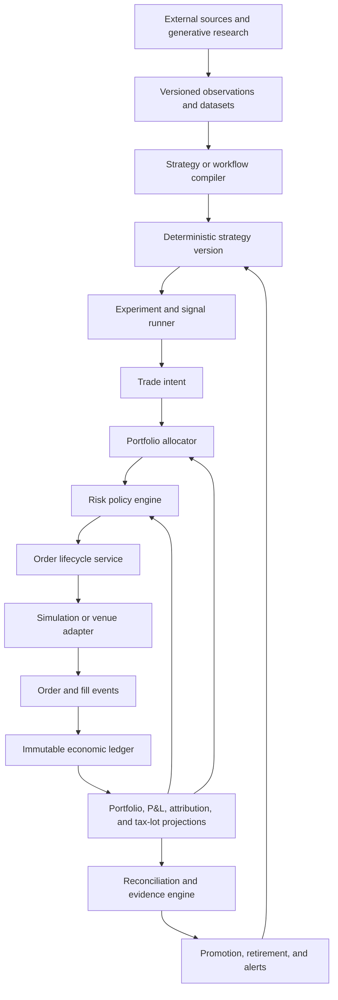

# Augr Total Overhaul Plan

## Executive decision

Rebuild Augr as an autonomous, personal, paper-first trading research and execution laboratory. The project is not a product, fund, signal service, or business. Its purpose is to determine whether a trustworthy autonomous system can discover, evaluate, and operate modestly profitable strategies while producing an exact explanation of what happened.

The overhaul is a consolidation, not a greenfield rewrite. Keep the broker adapters, market integrations, risk controls, paper-account restoration, realistic backtest components, portfolio allocator, observability, UI shell, and the deterministic copy-trading foundation. Replace the fragmented center with four authoritative cores:

1. an immutable economic ledger;
2. a common intent, order, fill, settlement, and reconciliation lifecycle;
3. a point-in-time research and promotion system;
4. an autonomous control plane in which AI can generate and critique work but cannot bypass deterministic trading and risk contracts.

No additional product interview is needed before implementation. Remaining choices should be versioned configuration or evidence-driven decisions, not hidden assumptions in code.

## Locked mandate

| Decision | Mandate |
| --- | --- |
| Purpose | Fun, technically ambitious personal project; modest profitability is sufficient. |
| Product direction | Do not pivot to selling Augr, managing outside funds, publishing signals, or copy-trading for other users. |
| Current environment | Paper only. Live credentials and live submission remain disabled throughout this program. |
| Default starting capital | $100,000 paper net liquidation value. |
| Capital portability | The same strategy and accounting architecture must work from $500 through at least $5 million. |
| Margin | Support broker-realistic margin in scored experiments and an explicitly unscored unlimited-margin stress mode. |
| Risk tolerance | Paper losses may be large, but an emergency brake, exposure limits, and failure containment are mandatory. |
| Asset scope | Architecturally open to any asset or venue; implementation remains adapter-by-adapter and evidence-gated. |
| Autonomy | The intended steady state is deposit/configure, then unattended operation with alerts and fail-closed recovery. |
| Options | Assignment, exercise, expiration, and owning assigned stock are acceptable. |
| Users | One operator and one beneficial owner. No multi-tenant or public-user requirements. |
| Preferred work | AI systems, infrastructure, and generative research workflows should be first-class surfaces. |

### Why unlimited paper margin cannot be the scored default

An unlimited balance is useful for saturation, capacity, and failure testing. It is not useful for measuring economic performance. It removes financing constraints, hides position-sizing bugs, allows impossible recovery trades, and produces results that cannot transfer to a $500 or $5 million account.

Augr therefore needs two distinct paper modes:

- `paper_scored`: declared capital tier, broker-realistic buying power, fees, settlement, borrow, and portfolio constraints. Only this mode can produce promotion evidence.
- `paper_stress`: configurable or unlimited buying power for chaos, throughput, and risk-breaker tests. Results are labeled synthetic and excluded from strategy rankings.

Never merge their orders, positions, ledger, performance, or dashboards.

## Starting point and repository boundary

This plan targets `main` commit `5517405`, which contains migration `000063_stock_copy_trading` and the paper-only 13F replication MVP. The current planning worktree is at `abec3ea`; implementation must begin from an updated branch based on `main`, not by assigning migration 63 to a second feature.

### Preserve and extend

| Existing component | Decision |
| --- | --- |
| `internal/execution/alpaca`, `binance`, `kalshi`, `polymarket` | Preserve as venue adapters; move economic state and lifecycle decisions out of adapter-specific code. |
| `internal/execution/paper` | Replace immediate-fill authority with a configurable simulation venue backed by shared fill models. Retain restoration APIs during migration. |
| `internal/backtest` fill, latency, depth, queue, adverse-selection, options, replay, and walk-forward components | Promote into the common simulation/research core rather than reimplementing them. |
| `internal/risk` kill switches, persisted breaker state, exposure checks, and capital ladder | Preserve, then change inputs from fragmented position repositories to the authoritative portfolio projection. |
| `internal/portfolio` opportunity and allocator work | Preserve scoring as an experimental allocator, but remove it as a second execution/accounting path. |
| `internal/copytrading` | Keep deterministic target construction and source provenance; fix freshness, drift, execution, attribution, and evaluation gaps. |
| `internal/providergovernor` | Make mandatory for every external provider and broker adapter. |
| PostgreSQL and TimescaleDB | Keep as the system of record. Use immutable events and materialized projections rather than introducing another database. |
| Existing web application | Keep as operator console; rebuild pages around accounts, experiments, evidence, risk, and reconciliation. |
| LLM pipeline and memory | Retain as a research/control-plane capability. Remove it from the default order hot path. |

### Supersede

- Supersede ADR-006 paper assumptions with quote-aware, venue-specific simulation.
- Supersede ADR-009's general human review requirement for paper mode with deterministic promotion and risk gates. Live activation remains a separate future decision.
- Replace `active/paused/inactive` plus `is_active` ambiguity with one lifecycle state machine.
- Replace strategy-created paper accounts and fake backing strategies with explicit accounts and execution origins.
- Demote bar-return win rate and profit factor from promotion metrics; retain them only as descriptive curve diagnostics.
- Retire fixed-probability and synthetic-depth prediction-market logic from scored execution.

## Target architecture



### Runtime separation

Run five logical services in one deployable Go application initially. Preserve module boundaries so they can split later without requiring distributed systems now.

1. **Ingestion:** market data, filings, news, calendars, reference data, and broker streams.
2. **Research:** datasets, experiments, replays, generated strategy specifications, and evaluation.
3. **Decision:** deterministic signals, targets, portfolio allocation, and risk admission.
4. **Execution:** order state machine, venue adapters, simulation, settlement, and reconciliation.
5. **Operations:** scheduler, leases, health, alerts, emergency controls, and the operator API.

PostgreSQL transactions and an outbox table are the initial event bus. Do not add Kafka or another operational dependency until measured throughput requires it.

## Canonical domain contracts

Every market-specific adapter must translate into these common concepts.

### Account

An account is the economic and risk boundary. It is not inferred from a strategy.

Required fields:

- stable account ID;
- environment: `paper_scored`, `paper_stress`, `shadow`, or future `live`;
- venue and external account ID when applicable;
- base currency;
- starting capital and capital-flow history;
- buying-power policy and margin profile;
- current lifecycle status;
- immutable creation metadata.

### Instrument

Create a canonical instrument master rather than using ticker strings as identity. An instrument includes asset class, venue, currency, tick and lot size, multiplier, expiration, exercise style, settlement method, and provider identifiers. Symbols become dated aliases. Corporate actions and futures rolls must not silently rewrite historical identity.

### Execution origin

Every intent, order, fill, position lot, and P&L contribution carries a typed origin:

- `strategy_version`;
- `copy_subscription`;
- `portfolio_rebalance`;
- `risk_reduction`;
- `operator`;
- `settlement`;
- `reconciliation`.

An origin can reference a strategy, experiment, copy observation, or operator action. It must not require creating a fake strategy record.

### Strategy family, version, and deployment

- **Family:** the durable thesis, such as quality-filtered wheel or 12-1 momentum.
- **Version:** immutable code/config/data-contract combination with a content hash.
- **Experiment:** one reproducible evaluation of a version against a dataset and simulation policy.
- **Deployment:** assignment of an approved version to an account, capital budget, schedule, and risk policy.

The same version may have several experiments and deployments. Editing rules creates a new version; it never changes historical evidence.

### Intent and order lifecycle

An intent says what economic change is desired and why. It is not a broker order.

```text
proposed -> allocated -> risk_approved -> routed -> working
                                      \-> risk_rejected
working -> partially_filled -> filled
working -> cancelled | expired | rejected
any nonterminal state -> failed_reconciliation
```

Intent creation and order submission use idempotency keys. Every state transition is append-only, timestamped, and linked to the market-data snapshot used for the decision.

## Workstream A — Immutable economic ledger

### Objective

Create one source of truth for cash, collateral, positions, realized P&L, fees, settlement, and capital flows across all venues and modes.

### Design

Use double-entry postings with numeric amounts and explicit units. Store raw venue events separately, then derive balanced ledger transactions. Recommended accounts include:

- cash by currency;
- unsettled cash and receivables;
- security inventory by instrument and lot;
- option premium and contract inventory;
- event-contract inventory;
- margin collateral and borrowing;
- realized P&L;
- fees, rebates, interest, borrow, data, and model costs;
- deposits and withdrawals;
- settlement and assignment clearing accounts.

Market value and unrealized P&L are projections using immutable mark observations, not destructive updates to historical cost.

### Repository changes

- Add `internal/ledger` for transactions, postings, lot matching, marks, and projections.
- Move financial mutation out of `internal/execution/paper/broker.go` and venue-specific order managers.
- Keep `orders`, `trades`, and `positions` as compatibility projections until parity is proven.
- Add explicit account and origin IDs to all new economic events.
- Store decimal quantities and money as PostgreSQL `NUMERIC`; avoid binary floating point in the authoritative ledger.

### Invariants

- Every ledger transaction balances by currency and unit.
- A fill is applied once even after retry, restart, or duplicated broker events.
- Cash cannot change without a referenced economic event.
- Closed-lot realized P&L includes allocated entry and exit costs.
- Equity equals cash plus marked assets minus liabilities.
- Rebuilding projections from the event log produces byte-equivalent economic totals.

### Exit gate

For 30 consecutive daily snapshots, every paper and external paper account reconciles cash, buying power, positions, fees, and equity to its authoritative source or to the simulation event log with zero unexplained drift.

## Workstream B — Capital, margin, and scale portability

### Capital profiles

Evaluate every candidate at several tiers using the same signals and dates:

| Tier | Primary constraints to expose |
| ---: | --- |
| $500 | Fractional availability, minimum contract/notional, concentration, options infeasibility. |
| $5,000 | Cash drag, assignment affordability, limited diversification. |
| $25,000 | Day-trading and option collateral boundaries where applicable. |
| $100,000 | Default paper operating account and main dashboard. |
| $1,000,000 | Participation rate, market impact, strategy capacity. |
| $5,000,000 | Venue concentration, depth, borrow, and operational capacity. |

### Requirements

- Capital flows are first-class ledger events; deposits do not reset performance history.
- Time-weighted and money-weighted returns are both available.
- Margin is a policy module selected by venue/account profile, not simply `buying_power = cash`.
- The simulator supports cash, Reg-T-like, portfolio-style, and stress/unlimited profiles without claiming perfect broker parity.
- Capacity constraints use participation rate, quote depth, spread, and order duration.
- A strategy may be valid only for a subset of capital tiers; this is a result, not a failure.

### Starter paper defaults

Use these as conservative operating defaults, not permanent strategy truths:

- scored net liquidation value: $100,000;
- target gross exposure: 70%; hard gross exposure: 100%;
- cash reserve: 20%;
- maximum position: 5% unless the strategy contract justifies a lower or higher cap;
- maximum strategy sleeve: 20%;
- maximum event-market aggregate exposure: 10%;
- warning at 5% drawdown, pause new risk at 10%, hard emergency halt at 15%;
- maximum daily realized plus marked loss: 3%;
- no automatic reset of a hard emergency halt.

The stress account may lift these limits but cannot contribute to promotion metrics.

## Workstream C — Common execution and simulation engine

### Objective

Backtest, internal paper, external paper, shadow, and future live execution must share one order state machine and differ only in venue capabilities and fill source.

### Components

- `internal/execution/lifecycle`: idempotent intent and order state machine.
- `internal/execution/venue`: capability discovery, submission, cancellation, status, fills, balances, positions, and calendar contract.
- `internal/simulation`: configurable venue simulator using current backtest fill, latency, queue, depth, adverse-selection, and options models.
- `internal/reconciliation`: local-to-venue comparison, drift classification, and controlled correction intents.

### Quote and fill contract

Every executable decision needs:

- bid, ask, last, and mark where available;
- provider and venue;
- exchange and receive timestamps;
- quote age at intent and route time;
- size/depth used for capacity;
- tick and lot rules;
- spread and expected cost;
- session and market status.

Fail closed on missing or stale required fields. A missing spread is not zero.

### Simulation policies

Implement versioned policies by asset class:

- **Equities:** bid/ask crossing, spread capture for resting limits, ADV participation, latency, partial fills, corporate actions, dividends, and settlement.
- **Options:** quote-side execution, contract multiplier, whole contracts, multi-leg atomicity assumptions, assignment, exercise, expiration, dividends, pin risk, and early exercise scenarios.
- **Crypto:** venue fees, precision, 24/7 calendars, depth, maker/taker behavior, funding for derivatives when added, and venue outages.
- **Prediction markets:** contract ticks, fee schedule, book depth, maker queue, partial and orphan fills, settlement, cancellation, resolution, and capital lockup.
- **Futures:** contract definitions, initial/maintenance margin, variation settlement, roll policy, expiry, session breaks, and exchange fees before any futures strategy is scored.

### Exit gate

One golden replay must produce consistent intents and economic outcomes across backtest and internal paper when fed the same timestamped observations. Differences from external paper must be measured and attributed to known venue behavior.

## Workstream D — Emergency brake and autonomous safety

### Brake hierarchy

Extend the existing persistent global and per-market kill switches with:

- account scope;
- strategy-deployment scope;
- provider/venue scope;
- entry-only halt;
- cancel-working-orders action;
- reduce-only mode;
- explicit flatten action requiring a separate command;
- heartbeat watchdog and stale-data trip;
- restart persistence and acknowledgement workflow.

Do not automatically flatten on every error. Cancellation and liquidation can make an incident worse. The default emergency action is: stop new exposure, cancel safe-to-cancel entries, preserve protective exits, and alert.

### Trip conditions

- ledger imbalance or reconciliation drift above zero tolerance for cash/fills;
- stale required market data;
- duplicate or impossible fill transition;
- daily loss or drawdown threshold;
- abnormal order rate or turnover;
- provider authentication or clock-skew failure;
- scheduler lease duplication;
- position outside declared account or strategy caps;
- repeated rejection or unexpected assignment;
- operator command, file flag, or startup environment flag.

### Exit gate

Automated drills prove that API, database, file, and environment mechanisms survive process restart; no new exposure occurs after activation; protective exits still work in reduce-only mode; and resumption requires explicit acknowledgement.

## Workstream E — Point-in-time data platform

### Objective

Make every research result reproducible and prevent future information from entering historical decisions.

### Data contract

Each dataset manifest stores:

- provider and source identifiers;
- request/query or file hash;
- effective, published, observed, and available-at timestamps;
- symbology version;
- adjustment policy;
- timezone and calendar;
- revision and correction lineage;
- row count and quality checks;
- license/retention metadata;
- content hash.

### Required datasets

- equities and ETFs: prices, quotes, corporate actions, fundamentals, and benchmark constituents;
- options: chains, NBBO, open interest, rates/dividends, expirations, and contract definitions;
- filings: original and amended 13F/Form 4 documents and availability timestamps;
- prediction markets: book snapshots, trades, fees, market rules, and final resolution;
- futures only when added: point-in-time definitions, rolls, settlements, and session calendars.

### Quality gates

- uniqueness and monotonic timestamps;
- missing-session and stale-quote detection;
- split/dividend reconciliation;
- bid less than or equal to ask;
- nonnegative volume/depth;
- identifier validity windows;
- provider-to-provider spot comparisons;
- quarantine rather than silent repair for material defects.

## Workstream F — Research and evidence laboratory

### Experiment specification

An experiment pins:

- strategy version and source commit;
- dataset manifests;
- universe construction as of each date;
- benchmark and cash return;
- capital tier and margin profile;
- simulation version and cost model;
- train, validation, and test windows;
- parameter grid or generation lineage;
- random seed;
- promotion policy version.

### Evaluation sequence

1. deterministic unit examples;
2. in-sample development;
3. walk-forward validation with purge/embargo where needed;
4. untouched out-of-sample test;
5. regime and parameter-stability analysis;
6. fee, spread, latency, and impact sensitivity;
7. bootstrap confidence intervals and return-concentration analysis;
8. multiple-testing adjustment across generated variants;
9. live-data shadow comparison;
10. realistic paper deployment.

### Metrics

Primary metrics:

- after-cost total and annualized return;
- benchmark excess return and information ratio;
- maximum drawdown and recovery time;
- Sharpe, Sortino, and Calmar with stated frequency assumptions;
- trade-level expectancy and profit factor;
- turnover and total ownership cost;
- exposure and concentration;
- capacity by capital tier;
- tracking error for replication strategies;
- fill ratio and modeled-versus-observed slippage;
- sample size and uncertainty intervals.

Keep bar-return win rate only as a curve descriptor. Never present it as trade win rate.

### Promotion rule

Promotion is a policy evaluation, not a mutable status chosen in the UI. A candidate must show positive after-cost expectancy in the untouched test and shadow/paper evidence, acceptable drawdown, no critical data defects, stable behavior under reasonable perturbations, and a clear advantage or diversification benefit relative to the passive control.

## Workstream G — Strategy lifecycle and portfolio allocation

### Lifecycle

```text
idea -> specified -> researching -> validated -> shadow -> paper_candidate
paper_candidate -> paper_active -> scale_candidate -> scaled
any nonterminal state -> paused -> retired
```

Only deployments in `shadow`, `paper_candidate`, `paper_active`, or `scaled` may be scheduled. Discovery output begins at `idea`; it never starts active.

### Initial strategy portfolio

Limit the first program to these families:

1. passive benchmark control;
2. quality-filtered wheel;
3. cross-sectional momentum plus quality/low-volatility controls;
4. time-series trend across liquid ETFs initially;
5. selected 13F replication;
6. defined-risk volatility premium;
7. complete-set prediction-market arbitrage;
8. maker-first prediction-market quoting after book simulation is validated.

Do not activate all eight simultaneously. Start with the benchmark plus two deterministic candidates, then add one family at a time.

### Allocator

The allocator receives normalized opportunities or target portfolios and returns approved account-level intents. It must:

- use authoritative ledger projections;
- prevent duplicate and conflicting exposure;
- consider correlation and common underlyings;
- reserve cash, margin, and event collateral;
- allocate by risk and capacity rather than strategy confidence alone;
- provide deterministic rejection reasons;
- use compare-and-claim leases for multi-instance safety;
- never infer missing liquidity or edge as zero-cost approval.

## Workstream H — Copy-trading hardening

Keep the new `copy_leaders`, sources, observations, mappings, subscriptions, and immutable 13F snapshots. Make the following changes before treating 13F replication as evidence-bearing:

1. Add `max_source_age`, `max_quote_age`, and fail-closed quote requirements.
2. Replace daily close execution prices with timestamped bid/ask or an explicitly delayed evaluation price.
3. Populate and enforce real spread observations; missing spread rejects the intent.
4. Run drift reconciliation every eligible session, not only when a new filing is ingested.
5. Track remaining target drift and complete it across bounded sessions after turnover caps.
6. Replace backing-strategy attribution with `copy_subscription` execution origin.
7. Add amendment, supersession, restart, concurrency, idempotency, mapping-expiry, and corporate-action tests.
8. Build a point-in-time multi-manager, multi-filing replay using actual publication availability.
9. Report mapped, excluded, derivative, and confidential/unknown weight as cash.
10. Evaluate after-publication return, benchmark alpha, tracking error, turnover, cost, and manager-selection stability.
11. Require a manager-selection rule fixed before the test period; do not select famous managers using future performance.
12. Keep paper-only status until all common promotion gates pass.

## Workstream I — Prediction-market reconstruction

### Structural strategies first

Prioritize complete-set and mutually exclusive outcome arbitrage because the payoff can be calculated directly. Require all-leg reservation, executable depth, exact fees, and positive worst-case value after an orphan-leg scenario.

### Market making second

Implement post-only quoting with inventory skew, stale cancellation, maximum time in queue, adverse-selection markouts, per-market inventory caps, and resolution/closure handling. Score spread capture net of adverse selection and locked capital.

### Directional forecasting last

Directional models must output calibrated probabilities and abstain when edge does not clear fees, spread, uncertainty, and resolution risk. Track Brier/log loss by probability bucket and compare every model to market price and simple domain baselines. Remove any fixed fair-probability default from scored decisions.

## Workstream J — AI and generative workflow control plane

### Desired role

AI is a force multiplier for research and operations, not an oracle with an order button.

Build versioned workflows that can:

- propose falsifiable hypotheses;
- generate a typed strategy specification from a constrained schema;
- generate implementation and tests on a branch;
- create experiment grids and data requirements;
- critique leakage, multiple testing, and cost assumptions;
- compare results to baselines;
- summarize filings and market rules with source timestamps;
- investigate operational incidents;
- recommend promotion or retirement with cited evidence.

### Hard boundary

An LLM cannot directly submit an order, change a risk limit, promote itself, alter historical evidence, or bypass a failed gate. It may create a candidate artifact. Deterministic services validate and execute that artifact.

### Generative strategy contract

Generated work must compile into:

- typed inputs and freshness requirements;
- deterministic entry, exit, and sizing rules;
- explicit universe and benchmark;
- prohibited behaviors;
- cost and capacity assumptions;
- property and example tests;
- retirement criteria;
- authoring model, prompt hash, token count, and monetary cost.

Deduplicate generated hypotheses by family and behavior. New variants become experiment arms under one family, not new active strategies.

## Workstream K — Autonomy, scheduling, and operations

### Job contract

Every recurring job has:

- stable job type and version;
- idempotency key;
- compare-and-claim lease;
- bounded retry policy by error class;
- checkpoint and progress record;
- dead-letter/attention state;
- dependency-health requirements;
- maximum runtime and cancellation behavior;
- structured result counts;
- no-op semantics that are distinguishable from failure.

### Autonomous daily loop

```text
health and clock checks
  -> reconcile accounts and settlements
  -> ingest and validate data
  -> update marks and risk projections
  -> evaluate due deployments
  -> allocate and risk-check intents
  -> route or simulate orders
  -> consume fills and settlements
  -> reconcile again
  -> compute evidence and drift
  -> notify only on decisions, anomalies, and daily summary
```

Provider outage or corrupt data defaults to no new exposure. Exit and settlement workers remain available when safe.

### Operator experience

Reorganize the UI around:

- account truth and capital flows;
- global/market/account/strategy brake status;
- reconciliation exceptions;
- strategy families, versions, and promotion evidence;
- experiments and reproducibility manifests;
- paper-scored versus stress results;
- execution-quality diagnostics;
- copy-source freshness and drift;
- AI workflow runs, artifacts, costs, and approvals;
- one daily autonomous operations brief.

## Provider and venue plan

### Near-term recommendation

1. **Keep Alpaca as the primary US equity/options paper adapter.** It already exists in Augr, paper options are enabled, and the API covers option contracts, positions, fills, assignment/exercise/expiration activities, and market data. Its paper behavior still requires independent modeling and reconciliation: paper non-trade option activities may appear the next day, and assignment events require REST polling rather than relying only on WebSockets. See [Alpaca options documentation](https://docs.alpaca.markets/us/docs/options-trading).
2. **Keep Kalshi as the event-market venue.** Use the demo/live-data boundaries honestly and preserve exact fee, depth, resolution, and settlement provenance.
3. **Add Tradier only as an options integration cross-check after the common lifecycle is complete.** Its sandbox exposes the trading API for equities and complex options, but sandbox market data is delayed; do not use its sandbox quote as an execution-quality ground truth. See [Tradier environments](https://docs.tradier.com/docs/endpoints) and [trading API](https://docs.tradier.com/docs/trading).
4. **Defer Interactive Brokers until broad live multi-asset or futures support is justified.** It is the strongest strategic candidate for broad asset coverage, but its gateway/session operations and paper/live behavioral differences create substantial complexity. Its own documentation warns that paper execution can vary from live behavior. See [IBKR paper trading](https://www.interactivebrokers.com/docs/tws-api/doc/notes-limitations/limitations/paper-trading).
5. **Evaluate Databento for decision-grade historical replay and future futures/options work.** Its normalized historical/live/reference coverage includes equities, OPRA options, futures, order-book data, corporate actions, security master, and market replay. Go can use its HTTP historical and Raw live APIs, but licensing and data cost must be tracked as experiment costs. See [Databento quickstart and coverage](https://databento.com/docs/quickstart).

### Adapter order

```text
common lifecycle and ledger
  -> Alpaca equities/options
  -> Kalshi
  -> internal simulation
  -> Binance or current crypto test environment
  -> Tradier comparison adapter
  -> IBKR/futures only after an approved design experiment
```

“Anything” is an architectural capability, not permission to implement every venue before one strategy works.

## Database migration sequence

Begin after migration 63 on `main`. Exact columns should be finalized in ADRs and tests, but preserve this dependency order.

| Migration | Scope | Cutover rule |
| --- | --- | --- |
| 064 | `accounts`, `capital_flows`, account environment and margin profile | Backfill one explicit paper account; do not infer future accounts from strategies. |
| 065 | `ledger_transactions`, `ledger_postings`, `mark_observations`, projection checkpoints | Dual-write from existing financial lifecycle; abort on unbalanced postings. |
| 066 | canonical instruments, aliases, venue contracts, corporate actions | Backfill existing symbols with effective-date aliases; quarantine ambiguity. |
| 067 | execution origins, intents, intent events, order events, fill events | Link existing orders/trades where provenance is defensible; label unknown rather than inventing it. |
| 068 | strategy families, immutable versions, experiments, deployments, lifecycle events | Map current strategies to legacy families; no legacy record becomes validated automatically. |
| 069 | dataset manifests, observations, quality findings, experiment inputs | Pin new experiments; historical legacy runs remain `legacy_unpinned`. |
| 070 | promotion policies, evaluations, evidence links, retirement decisions | Promotion becomes computed and auditable. |
| 071 | risk-policy versions, scoped brake events, acknowledgements, watchdog state | Migrate current global/market breaker state without auto-clearing it. |
| 072 | provider costs, model costs, data licenses, operational cost attribution | Replace zero-as-unknown with nullable/estimated/actual cost states. |

Do not drop legacy tables during these migrations. Run dual projections, reconcile, cut reads over, then remove obsolete writes in a later cleanup migration.

### Cutover method

Use a strangler migration rather than a flag-day rewrite:

1. add the new schema and pure domain packages without changing trading behavior;
2. backfill only facts that have defensible provenance and label the rest `legacy_unknown`;
3. dual-write or translate new lifecycle events into both the legacy and new projections;
4. compare ledger, order, fill, position, and P&L projections continuously;
5. switch read paths one bounded context at a time behind a killable feature flag;
6. stop legacy writes only after a recorded parity window;
7. retain rollback reads until the next release proves stable;
8. remove dead code and columns in separate cleanup changes.

Do not combine the ledger, execution, strategy-lifecycle, and AI cutovers in one pull request. Each boundary needs its own invariant tests and rollback instructions.

## Dependency-ordered engineering backlog

### Milestone 0 — Baseline and containment

| ID | Work | Acceptance |
| --- | --- | --- |
| OVR-001 | Branch from `main` and capture database/code/config baseline | Commit, schema 63, strategy inventory, account snapshot, and open exposure are recorded. |
| OVR-002 | Freeze generative activation and mass scheduling | New discoveries create `idea` artifacts only; no automatic active strategy creation. |
| OVR-003 | Define and isolate scored versus stress paper modes | Configuration, storage namespaces, metrics, and UI cannot mix scored and synthetic stress results. |
| OVR-004 | Expand emergency-brake drills | Entry halt, reduce-only, restart persistence, and out-of-band activation pass. |
| OVR-005 | Write ADRs for ledger, lifecycle, paper modes, and AI boundary | Decisions are accepted before schema or interface cutover. |

#### Phase 0 implementation record — 2026-08-14

Phase 0 is code-complete on `codex/augr-overhaul`. It intentionally makes no production database, scheduler, strategy, or deployment mutation; those remain explicit operator actions after review.

| ID | Result | Evidence and handoff |
| --- | --- | --- |
| OVR-001 | Complete | The reproducible [Phase 0 baseline](../../reports/2026-08-14-phase-0-baseline.txt) and SHA-256 sidecar record commit identity, runtime image, safe configuration, schema state, strategy inventory, pipeline outcomes, orders, trades, positions, reconciliation indicators, risk state, automation, and copy-trading schema. It exposes the important starting mismatch: code expects schema 63 while the observed runtime remains on schema 62 and an older application image. |
| OVR-002 | Complete in code; production quarantine pending review | New generative discoveries are paper-only, inactive `idea` artifacts with no schedule and manual promotion metadata. Durable-backtest completion can no longer reactivate them. `scripts/freeze-generated-strategies.sh plan` found 171 legacy candidates; `apply` was deliberately not run against production and requires an explicit confirmation token. |
| OVR-003 | Containment contract complete; account persistence continues in OVR-101 | `paper_scored` and `paper_stress` have distinct configuration identities, evidence classes, storage namespaces, broker profiles, and metrics. API and UI surfaces show the runtime profile and fail closed for stress or unlabelled evidence. Existing database aggregates predate account namespaces, so they are explicitly returned as `results_isolated=false` with a legacy-unscoped warning and cannot be treated as promotion evidence. Physical account-scoped persistence, deposits, and margin enforcement begin in OVR-101 rather than being faked here. |
| OVR-004 | Complete | Entry orders halt under global, market, or breaker stops; only position-proven close intents pass as reduce-only and quantities are clamped to owned exposure. Kill-switch state persists across restart, state-load failure starts stopped, state-save failure is reported, and `scripts/emergency-brake-drill.sh` exercises API/file/env activation, restart, entry halt, and reduce-only behavior. |
| OVR-005 | Complete | Accepted ADRs define the immutable ledger, common execution lifecycle, scored/stress paper boundary, and deterministic AI order boundary before schema cutover. |

Local or deployment follow-up must preserve this order: review the branch, deploy schema 63, recapture the baseline, review and explicitly apply the legacy generated-strategy quarantine, run the emergency-brake drill in the target environment, and only then resume selected paper automation. No legacy strategy should be reactivated merely because it existed before Phase 0.

### Milestone 1 — Economic truth

| ID | Depends on | Work | Acceptance |
| --- | --- | --- | --- |
| OVR-101 | OVR-001, OVR-003, OVR-005 | Add accounts and capital flows | Deposits at every capital tier preserve return history and reconcile. |
| OVR-102 | OVR-101 | Implement balanced ledger | Property tests reject unbalanced, duplicate, or wrong-currency postings. |
| OVR-103 | OVR-102 | Adapt fills, fees, settlements, options events, and prediction payouts | All supported economic events create idempotent ledger transactions. |
| OVR-104 | OVR-103 | Build cash, lot, position, P&L, and equity projections | Rebuild from zero matches stored projections. |
| OVR-105 | OVR-104 | Dual-run legacy and new accounting | Differences are classified; unexplained drift is zero before cutover. |

#### Phase 1 local implementation record — 2026-08-14

OVR-101 and OVR-102 are complete locally on `codex/augr-overhaul`; neither has been deployed, and no legacy read or write path has been cut over. Migration 64 creates explicit immutable account identities and append-only capital flows, seeds one clearly labelled default scored-paper account without inventing ownership for legacy results, and enforces account currency, evidence-class, namespace, margin-profile, and JSON-object boundaries in the database. The matching domain and PostgreSQL repository use exact decimal values, create opening capital atomically, replay identical idempotent deposits, reject mismatched reuse, and reconcile the `$500` → `$5,000` → `$25,000` → `$100,000` → `$1,000,000` → `$5,000,000` tier sequence without changing the original `$500` starting-capital fact.

Migration 65 adds the append-only double-entry boundary: immutable ledger transactions and postings, exact `NUMERIC(38,12)` signed quantities, independent balance enforcement for every currency or instrument unit, durable origin/reference identity, mark observations, and append-only projection checkpoints. Every transaction declares its posting count at creation, so deferred commit checks reject missing, extra, unbalanced, cross-currency, or late-appended postings. Deterministic backfill covers only defensible capital-flow facts, and the capital-flow trigger atomically dual-writes deposits and withdrawals with correct debit/credit signs. The Go ledger constructor and PostgreSQL repository enforce the same precision, normalization, provenance, immutability, and idempotency contract; retries tolerate PostgreSQL timestamp precision while exact JSON-number comparison rejects materially different payloads. Fill, fee, settlement, option, and prediction-market normalization remains intentionally deferred to OVR-103.

Local qualification used isolated loopback-only PostgreSQL and Redis services, applied migrations 1–65, exercised both economic migrations down/up, and reran finalized migration 65 from schema 64 with accounts and capital flows preserved, deterministic IDs restored, declared and actual posting counts equal, and zero per-unit imbalance. Short tests, repository-wide race tests, focused database race suites, vet, lint, backend build, all 162 frontend tests, frontend lint/build, and a compiled kill-switched smoke runtime passed; `/health`, `/healthz`, and `/api/v1/health` each reported database and Redis `ok` against clean schema 65. OVR-103 was the next dependency-ordered item at that checkpoint and is now recorded below.

Broader inherited gates remain visible rather than being folded into this economic-boundary change: `task fmt:check` reports repository-wide drift in pre-existing files under the installed `gofumpt` 0.11.0 while every Phase 1 Go file is clean; the all-package database-enabled run still exposes pre-existing integration-harness isolation and JSONB-format assumptions even though the isolated OVR-101/102 database suites pass under the race detector; and `govulncheck` reports five reachable advisories in the existing pgx, gRPC, x/net, and x/text dependency graph. Toolchain, dependency, and legacy integration-harness remediation require separate reviewed changes before any release qualification.

#### OVR-103 local implementation addendum — 2026-08-15

OVR-103 is complete locally on `codex/augr-overhaul`; it has not been deployed, no shared database has been migrated, and no legacy broker, order, trade, position, expiration, settlement, or accounting path has been cut over. Migration 68 records byte-preserved raw JSON and its SHA-256 under an account-scoped source identity before interpretation. An identical retry converges while a changed revision, timestamp, or payload under that identity conflicts, so a provider revision cannot create a duplicate economic effect. Typed normalizations then atomically append one deterministic ledger transaction and its exact postings for buys, sells, attached or standalone fees/rebates, cash option settlement, zero expiration, all four physical exercise/assignment sign cases, and signed binary prediction payouts.

Physical option delivery uses immutable provenance-backed call/put, strike, currency, underlying, and deliverable terms rather than ticker parsing or caller-authored economics. Dated venue mechanics and the latest terms available by both event-effective and source-observed time must agree. Term append and physical normalization acquire the same per-option transaction lock in a standalone command before writing; a forced two-writer test proves that a competing historical term and normalization cannot both commit or rely on a pre-lock snapshot. Every cash leg remains in the account base currency, and the Go constructors plus deferred PostgreSQL semantic trigger independently reconstruct deterministic IDs, posting keys, units, signs, amounts, and counts. Direct SQL tests reject forged source, normalization, transaction, and posting IDs; wrong units, currencies, amounts, references, contract windows, missing/extra postings, mutation, and nonempty rollback.

Local qualification used the loopback-only PostgreSQL and Redis services. The persistent database rehearsed `67|false` → `68|false` → `67|false` → `68|false`, preserved one account, one capital flow, one ledger transaction, two ledger postings, and the empty schema-67 instrument/quote tables, and left all new economic tables empty. Focused domain tests and real PostgreSQL repository/migration suites passed under the race detector; repository-wide short race tests, backend build, vet, lint, all 162 frontend tests, frontend lint/build, touched-file `gofumpt`, and `git diff --check` passed. A compiled runtime with live trading disabled and `TRADING_AGENT_KILL=true` returned `{"status":"ok","db":"ok","redis":"ok"}` from `/health`, `/healthz`, and `/api/v1/health`, then shut down cleanly. Independent post-implementation review approved the final diff after the repository lock was moved ahead of the write into a separate statement, ensuring a fresh `READ COMMITTED` snapshot after contention. OVR-104 is the next dependency-ordered item.

Inherited gates remain separate from OVR-103: `task fmt:check` still reports only the same nine untouched files; the database-enabled all-package run still exposes the legacy `trades.exit_reason`, overnight-evidence JSON, shared migration-schema/OID, vector-extension, pipeline-column-count, and report-artifact-nullability assumptions while the isolated schema-68 suites pass; and `govulncheck` reports the same five reachable advisories in existing pgx, gRPC, x/net, and x/text versions. These failures were neither suppressed nor folded into the economic-event commit.

#### OVR-104 local implementation addendum — 2026-08-15

OVR-104 is complete locally on `codex/augr-overhaul`; it has not been deployed, no shared database has been migrated, no signing credential has been provisioned outside disposable tests, and no legacy portfolio, P&L, risk, API, UI, broker, order, trade, or position path has been cut over. The pure `internal/ledger` engine rebuilds from zero at an explicit bitemporal `as_of`, orders immutable events deterministically, fails on every unknown or inconsistent event, and produces byte-stable cash, net capital, signed FIFO lots, matches, open/closed positions, fees/rebates, realized and unrealized P&L, market value, equity, and total P&L. It handles long and short inventory, partial and multi-lot closes, direction crossings, exact residual-aware cost allocation, cash settlements, expiration, prediction payouts, all four physical option exercise/assignment cases, immutable delivery multipliers, and basis transfer without silently realizing the option leg. Exact equality of `realized + unrealized = total` is mandatory.

Canonical instrument marks require exact nonnegative decimals, immutable source identity, currency agreement, one explicit source/namespace, no observation or effective-time lookahead, and a positive age ceiling. Migration 69 leaves schema-65 legacy mark/checkpoint rows visibly noncanonical and unused, upgrades canonical rows without float or identity inference, and stores exact checkpoint bytes plus input/output checksums. The trigger independently verifies canonical mark identity and checkpoint bytes, output hash, policy, counts, account currency, deterministic UUID, exact bitemporal transaction count, and final transaction. Full replay checkpoints are immutable verified cache/evidence artifacts; they never become a second source of truth or an incremental cursor.

The final security review required genuine replay-worker attestation rather than trusting a database writer. Exact checkpoint bytes now carry a domain-separated HMAC-SHA256 under a versioned key ID. Owner-only 32-byte verifier keys are immutable, revocation is append-only, public access is revoked, and the security-definer persistence function has a pinned trusted search path with `pg_temp` last. `ProjectionRepo` receives the matching secret from an external provider and refuses any database identity that can direct-insert checkpoints, read verifier keys, or cannot execute the narrow function. Real non-owner PostgreSQL tests prove direct DML, key reads, altered captured signatures, revoked keys, and mismatched secrets fail without a checkpoint; identical signed rebuilds still converge. Database owners/migrators remain explicitly outside the boundary, and OVR-105 may not wire the projection until a reviewed secret store, workload identity, provisioning, rotation, and revocation ceremony exist.

Local qualification passed focused domain/repository/migration race suites, backend-wide short race tests, build, vet, lint, all 162 frontend tests plus frontend lint/build under pinned Node 22, touched-file `gofumpt`, finalized `68 -> 69 -> 68 -> 69` migration rehearsal, exact data preservation, and compiled kill-switched health smoke against loopback-only PostgreSQL/Redis. Independent final review approved the HMAC revision with no remaining P0/P1. The same inherited gates remain visible: nine untouched formatter drifts, legacy DB-enabled shared-harness/JSON/schema assumptions, and five reachable dependency advisories. OVR-105 is now the next dependency-ordered Phase 1 item and must dual-run without unexplained drift before any cutover.

#### OVR-105 local implementation addendum — 2026-08-15

OVR-105 is complete as an additive local evidence mechanism on `codex/augr-overhaul`; it has not been deployed, no shared database has been migrated, and no legacy accounting read/write path, broker mutation path, ledger normalizer, API, UI, risk, allocator, or scheduler has been cut over. The new pure `internal/accountingrecon` boundary builds byte-stable legacy and immutable-ledger snapshots at one explicit account, UTC `as_of`, projection, mark, and capture-fence boundary. It retains binary-float provenance rather than applying a tolerance, compares exact decimals, distinguishes missing from zero, unions signed canonical-instrument positions, and classifies every fact as exact, independently explained, unexplained, or not comparable. Mutable in-memory fields are rederived against canonical bytes before persistence or gate evaluation.

The coordinator requires one verified account-scoped capture lease with a UTC acquisition time and holds it across both source reads. A paused-read adversarial test proves participating paper and ledger writers cannot interleave. The paper broker supplies one clone-safe balance/position snapshot under one read lock; the projection adapter accepts only one fully validated OVR-104 checkpoint and retains unavailable buying power explicitly. The current runtime does not make all participating writers share such a fence, so no runtime coordinator is wired. The current source capabilities also leave legacy fees and realized/unrealized P&L, plus ledger buying power, not comparable; those gaps remain visible and prevent real cutover rather than being treated as zeros.

Migration 70 adds append-only reconciliation parent/result evidence with exact source/run bytes, SHA-256, deterministic identities, capture fence fields, count summaries, structural explanation rules, and opaque future attestation fields. Deferred constraints reject incomplete result sets; Go reload revalidates canonical bytes and every relational child; identical and eight-writer retries converge; a forced child failure leaves no parent. Direct SQL tests reject forged run/snapshot/result identities, hashes, statuses, missing headers, and incomplete sets. Updates/deletes fail, downgrade locks first and refuses nonempty evidence, and the schema creates no key, role grant, controlled writer, or authenticity claim.

The cutover evaluator requires an injected authenticated evidence verifier and independently trusted evaluation clock. It accepts only 30 consecutive fully completed UTC dates through the last completed day for one account and unchanged policy; the current day, future endpoints/rows, conflicts, gaps, policy drift, invalid canonical bytes, incomplete positions, synthetic evidence, unknown/revoked/invalid attestations, and any unexplained or not-comparable result fail closed. A passing result is an evidence manifest only and has no read-switch callback or mutable flag.

Local qualification used only loopback PostgreSQL/Redis. The persistent database applied schema 70 and rehearsed the finalized `70|false -> 69|false -> 70|false` downgrade/reapply while preserving one account, one capital flow, one ledger transaction, two balanced postings, and zero reconciliation rows. Focused domain, paper, repository, and migration suites passed under the race detector. Backend-wide short race tests, build, vet, and lint passed; all 162 frontend tests, frontend lint, and production build passed under Node `v22.23.2`; touched Go files are `gofumpt`-clean and `git diff --check` passes. The rebuilt kill-switched binary returned database/Redis `ok` on all three health routes and shut down with zero in-flight runs. Independent review first found a caller-controlled future-window P1; the final revision injects trusted time and excludes the current/future UTC day, after which the reviewer approved with no remaining P0/P1.

`VERIFIED_LOCAL` applies only to this comparison, persistence, migration, and gate machinery. The real prospective 30-day window is `BLOCKED_EXTERNAL`, as are the common runtime fence, complete source coverage, projection secret store, non-owner workload identities, reconciliation attestation, authenticated reviewer workflow, key provisioning/rotation/revocation, alerts, protected-environment rehearsal, and a separately reviewed cutover/rollback change. The same inherited gates remain explicit: `task fmt:check` reports only the prior nine untouched files; the database-enabled all-package run still exposes legacy `trades.exit_reason`, overnight JSON formatting, shared migration-schema/type, vector-extension, pipeline-column-count, and report-artifact-nullability assumptions; and `govulncheck` reports the same five reachable advisories in existing gRPC, x/text, x/net, and pgx versions. None was suppressed or folded into OVR-105. OVR-203 is the next dependency-ready item.

### Milestone 2 — Market truth and execution

| ID | Depends on | Work | Acceptance |
| --- | --- | --- | --- |
| OVR-201 | OVR-005 | Canonical instrument and alias master | Corporate actions and dated aliases do not alter historical identity. |
| OVR-202 | OVR-201 | Timestamped quote/depth snapshot contract | Missing age, bid, ask, or source fails closed when required. |
| OVR-203 | OVR-102, OVR-202 | Common intent/order/fill lifecycle | Retries and restarts cannot duplicate economic effects. |
| OVR-204 | OVR-203 | Move backtest fill models into common simulation venue | Backtest and paper share identical lifecycle and policy versions. |
| OVR-205 | OVR-203 | Adapt Alpaca and Kalshi to common lifecycle | Adapter-specific order states map losslessly; unknown states halt safely. |
| OVR-206 | OVR-204 | Add capital-tier and margin profiles | The same replay runs at $500 through $5 million plus stress mode. |
| OVR-207 | OVR-104, OVR-205 | Common reconciliation service | Cash/fill/position drift creates incidents, not silent mutations. |

#### Phase 2 local implementation record — 2026-08-15

OVR-201 is complete locally on `codex/augr-overhaul`; it has not been deployed, no shared database has been migrated, and no legacy ticker read path has been cut over. Migration 66 adds stable canonical instruments, append-only dated alias events, venue-contract windows, immutable corporate-action facts, and explicit identity-quarantine findings. Active records require a verified asset class, currency, positive exact tick/lot/multiplier mechanics, and settlement method; active options additionally require expiration, exercise style, and an underlying identity. Incomplete legacy records cannot become active merely because a symbol exists.

The migration normalizes every existing typed symbol source into a deterministic quarantined identity and dated provenance alias without inventing market mechanics. Current `manual_verified` and `provider_verified` copy mappings become additional CUSIP, FIGI, or opaque provider aliases; ambiguous, stale, and ended mappings remain findings rather than being promoted to identity. The tables are append-only. Alias transitions are serialized per provider/type/value, reject out-of-order events and rebinding without a retirement, and resolve the latest event at or before the requested timestamp. A later corporate action, retirement, or symbol reuse therefore cannot change historical identity.

The Go `internal/instrument` boundary mirrors the database enums, normalization, `NUMERIC(38,12)` limits, option terms, quarantine provenance, effective-time windows, and corporate-action rules. Its PostgreSQL repository round-trips exact mechanics, resolves retired intervals as not found, returns original rows for identical retries, reports mismatched source-identity reuse as an idempotency conflict, and rejects overlapping venue windows. Focused domain, schema-66 migration, rollback, immutability, backfill, repository, and schema-version tests pass against the isolated loopback-only development database. The real local database rehearsed `65|false` → `66|false` → `65|false` → `66|false` while preserving its account, capital-flow, ledger-transaction, and ledger-posting counts. Repository-wide short race tests, build, vet, lint, all 162 frontend tests, frontend lint/build, and a compiled kill-switched runtime passed; `/health`, `/healthz`, and `/api/v1/health` each reported database and Redis `ok` on schema 66 before a clean shutdown.

The same inherited evidence-gate failures recorded after Phase 1 remain separate from OVR-201: repository-wide `task fmt:check` reports drift only in pre-existing files, the database-enabled all-package run exposes the existing shared integration-harness and legacy JSONB/column assumptions, and `govulncheck` reports the same five reachable advisories in existing pgx, gRPC, x/net, and x/text versions. Every OVR-201 Go file is `gofumpt`-clean, and all focused database suites pass under the race detector.

OVR-202 is also complete locally on `codex/augr-overhaul`; it has not been deployed, no shared database has been migrated, and no provider, cache, strategy, order, fill, or recorder path has been cut over. Migration 67 adds immutable canonical quote observations and exact ordered depth keyed to a stable instrument plus provider, venue, observation namespace, observation ID, and optional source revision. Exchange, ingress-receive, and authoritative decision-availability timestamps remain distinct. Point-in-time lookup requires `available_at <= as_of` inside one explicit namespace, so provider event time or import time cannot authorize lookahead. Missing values remain SQL `NULL` and Go pointers; a present zero is never conflated with missing bid, ask, or spread.

The observation store deliberately retains incomplete or mechanically invalid but attributable evidence. The generic `Assess` boundary checks only requested fact sufficiency, availability, freshness, market/session eligibility, and depth. `AssessForExecution` additionally requires a matching active and unexpired canonical instrument, a matching immutable venue contract effective at both observation and intent/route time, exact tick multiples for executable bid/ask/depth prices, and exact lot multiples for displayed top/depth sizes. Historical `last` and theoretical `mark` remain evidence rather than being asserted executable. Stable rejection codes make missing source, contract, availability, exchange time, book sides, depth, status, active identity, tick, and lot failures auditable. A deferred aggregate constraint enforces complete ordered, uncrossed depth at commit; a second transaction cannot append a late child row after the book is accepted.

Local qualification applied schema 67 to the isolated loopback-only database and rehearsed `66|false` → `67|false` → `66|false` → `67|false`. The rollback and reapply preserved one account, one capital flow, one ledger transaction, and two balanced postings; the canonical quote and depth tables remain empty because no adapter has been authorized to write them. Focused domain tests and real PostgreSQL repository/migration suites pass under the race detector, including exact persistence, idempotent replay, eight-writer convergence, no-lookahead selection, contract windows, retained off-tick/off-lot evidence, commit-time depth completeness, late-insert rejection, rollback, and no legacy float/JSON backfill. Repository-wide short race tests, build, vet, lint, all 162 frontend tests, frontend lint/build, and a compiled kill-switched runtime passed; `/health`, `/healthz`, and `/api/v1/health` each reported database and Redis `ok` on clean schema 67 before graceful shutdown. Independent post-implementation review approved the revised boundary after route-time contract validity and API-misuse protections were added.

The inherited evidence gates remain unchanged and separate from OVR-202: `task fmt:check` reports drift only in nine untouched files; the database-enabled all-package run still exposes the existing `trades.exit_reason`, overnight-evidence formatting, shared migration-schema, vector-extension, pipeline-column-count, and report-artifact-nullability assumptions; and `govulncheck` still reports five reachable advisories in existing pgx, gRPC, x/net, and x/text versions. Every OVR-202 Go file is `gofumpt`-clean, `git diff --check` passes, and all focused database suites pass under the race detector. The dependency-ordered next item returns to OVR-103 so fill, fee, settlement, option, and prediction-market effects have a ledger adapter before OVR-203 introduces the common execution lifecycle.

#### OVR-203 local implementation addendum — 2026-08-15

OVR-203 is implemented as an additive local boundary on
`codex/augr-overhaul`. It has not been deployed, no shared database has been
migrated, no provider or simulator writer has been activated, and no legacy
broker, order, trade, position, scheduler, risk, backtest, or paper path has
been cut over. The pure `internal/execution/lifecycle` package defines one
account-scoped deterministic intent, at most one immutable order command and
external binding, exact partial and complete fills, append-only transition
evidence, explicit recovery eligibility, and terminal unknown,
contradictory, correction, and bust observations. Intent, order, binding, fill,
and ordinary or revision-event identities use the same length-prefixed SHA-256
UUID contract as OVR-103. Exact zero fill price remains present and valid while
missing price fails.

Migration 71 creates five append-only tables and no grant or legacy backfill.
The intent row serializes transitions; PostgreSQL independently enforces the
state graph, immutable account/environment/origin/policy context, allocation
direction and magnitude, route quote availability, dated venue mechanics,
stable binding, exact cumulative fills, raw event bytes and SHA-256, and
separate correction/bust identity. Deferred completeness checks reject an
intent without its proposal, an order without its route, a binding without its
establishment event, and either side of an orphaned `execution_fill`
normalization/fill relationship. The down migration locks the normalization
and lifecycle graph first and refuses any nonempty rollback.

`ExecutionLifecycleRepo` reloads and replays the immutable aggregate, locks the
intent before applying a transition, detects a stream that advanced before the
lock, and retries from current state. The OVR-103 normalization writer is now a
transaction-scoped primitive: one fill operation commits the normalization,
ledger parent and postings, optional first binding, lifecycle fill, and event
together. Identical proposal, route, acknowledgement, immediate partial fill,
and immediate complete fill retries converge under eight writers;
multiple partial fills finish at the exact order quantity; an injected child
failure rolls back the whole economic graph; and eight copies of one correction
or bust produce one reconciliation-failure event and no second economic effect.
Revision identity uses the original fill source ID rather than the later
observation ID, and cumulative fill quantity exists exactly on fill events in
both Go and PostgreSQL.

Focused domain, repository, and schema-71 migration suites pass under the race
detector against loopback PostgreSQL. The earlier retained phase database was
preserved after its first schema-71 rehearsal rather than being rewritten after
final review changes. A separate final-qualification database applied
migrations `1 -> 71` from the finalized source and retained one immediate
zero-price fill plus a two-part exact fill path: one account, one capital flow,
two intents, two orders, two bindings, three fills, eleven lifecycle events,
three normalizations, four ledger transactions, and twelve postings. Its
revision index uses `original_source_event_id`, its cumulative-quantity check is
fill-kind exact, a fresh repository reconstructed both aggregates, and the
nonempty down migration refused without deleting evidence. Disposable isolated
schemas also prove empty `71 -> 70 -> 71`. Operational details and read-only
recovery queries are in
`docs/runbooks/common-execution-lifecycle.md`.

Repository-wide short race tests, build, vet, lint, all 162 frontend tests,
frontend lint/build, touched-file `gofumpt`, and `git diff --check` pass. A
compiled runtime with live trading and scheduler flags disabled, the global kill
switch active, no venue credentials, no automation embedding provider, and the
final schema-71 database returned database/Redis `ok` on `/health`, `/healthz`,
and `/api/v1/health`, then stopped with zero in-flight runs. Independent review
approved the final identity/cumulative corrections with no remaining P0/P1.
Existing database-enabled all-package failures remain separate: the legacy
`trades.exit_reason` mismatch, overnight evidence JSON assertion, shared
migration schema/type collisions, vector-extension teardown, pipeline-column
count, and report-artifact-nullability assumptions are unchanged. The nine
untouched formatter drifts and five reachable dependency advisories are also
unchanged and unsuppressed.

#### OVR-204 local implementation addendum — 2026-08-15

OVR-204 is complete as an additive local simulation boundary on
`codex/augr-overhaul`; it has not been deployed, no shared database has been
migrated, no writer grant or current-policy pointer was created, and no
simulator, provider, scheduler, legacy backtest, paper broker, promotion, or
live path was activated or cut over. Migration 72 stores the full immutable
canonical simulation-policy bytes with matching parsed JSON, SHA-256,
content-addressed version, and deterministic UUID. Every simulation order must
reference an existing exact artifact. PostgreSQL independently validates the
complete fixed-v1 shape and values, reconstructs the exact Go encoding, and
rejects correctly rehashed empty, incomplete, reordered, duplicated, or
whitespace-variant JSON before it can authorize an order. The migration refuses
any pre-existing schema-71 simulation order because its historical policy bytes
cannot be guessed, and its down path locks first and permits rollback only
while both artifacts and simulation orders are empty.

The new pure `internal/simulation` venue consumes one routed OVR-203 aggregate,
one eligible OVR-202 quote/depth snapshot, one dated OVR-201 venue contract,
one active account, and one explicit UTC evaluation time. Per-asset policy
declares supported order types and time-in-force values, explicit-session or
continuous-24/7 calendar, source/book/status/freshness requirements, fixed
latency, depth participation, exact fee terms, scale, and rounding. Missing,
stale, future, mismatched, off-tick, off-lot, out-of-session, unsupported, or
insufficient-depth facts fail closed. DAY expiry is tied to the route session's
half-open close; 24/7 policy cannot support DAY. Exact price-time depth
consumption emits at most one immutable fill per eligible level without
exceeding participation, venue lot, or remaining-order capacity.

The persistence coordinator records byte-stable raw simulator evidence before
delegating each fill to OVR-203's atomic normalization, ledger, binding, fill,
and lifecycle writer. Restart recovers the policy by the order's recorded
version. Interrupted multi-level replay, same-snapshot retries, and eight
concurrent writers converge without duplicated economic effects. Thin
backtest and internal-paper adapters share that venue and policy. Within one
ADR-018 mode their ordered fills and outcome hashes match; scored and stress
paper retain distinct evidence classes, storage namespaces, and hashes, while
shadow/live or mismatched account inputs fail closed. Legacy stochastic and
bar-based models were relocated without semantic relabelling under
`internal/simulation/legacy_*.go`; compatibility reports remain
`backtest-input-v1`. The old paper-market `$1.00` fallback was removed, so a
missing executable price now rejects without mutating portfolio state.

The final retained loopback-only qualification database was rebuilt from the
reviewed migrations `1 -> 72` and contains one account, one capital flow, one
exact policy artifact, one
intent, one order, one binding, two raw source events, two fills, six lifecycle
events, two normalizations, three ledger transactions, and fourteen postings,
with no orphaned graph. Artifact digest and deterministic identity recompute
exactly. A fresh repository reloads the policy and lifecycle; nonempty rollback
refuses without changing any count. A separate empty database proves `72 -> 71
-> 72`. The earlier OVR-203 database remains unchanged.

Focused race/replay/migration tests, the legacy-compatibility gate,
repository-wide short race tests, build, vet, lint, all 162 frontend tests,
frontend lint, and the 2,166-module production build passed under pinned Node
22. Touched Go files are `gofumpt`-clean and `git diff --check` passes. A
compiled local process with the kill switch active, live trading and scheduler
flags false, no venue credentials, schema 72, and isolated Redis returned
database/Redis `ok` from all three health routes and left the retained graph
unchanged. Startup still constructs the existing automation orchestrator and
stale-run reconciler even when the scheduler flag is false; this observed
runtime distinction is not treated as scheduler-cutover evidence.

Independent review initially found that self-consistent but semantically
invalid JSON could register under the first migration revision and authorize an
order that Go could not recover. The finalized database reconstructor, Go token
grammar, direct-SQL artifact/order attacks, and all-asset/calendar parity test
close that P1. Fresh migration and persistent replay evidence was rebuilt from
the reviewed source, after which the reviewer approved with no remaining P0/P1.

The inherited evidence gates remain separate: the database-enabled package
run still exposes the overnight empty-attempt JSON expectation and shared
migration enum/vector/column/nullability assumptions; repository formatting
still reports only nine untouched files; Go vulnerability scanning still
reports the same five reachable dependency advisories; and npm reports eight
existing dependency advisories. None was suppressed or auto-fixed. OVR-205 and
OVR-206 are now both dependency-ready; dependency-order execution proceeds to
OVR-205 before OVR-206, leaving shared/protected migration, real venue inputs,
external-paper fidelity, deployment, promotion, and live routing explicitly
blocked.

Reviewed OVR-204 implementation commit
`a81ecaf206b10430a030d81f05d7bcbd45d17ab1` was pushed to
`origin/codex/augr-overhaul` and reconciled at identical local/remote hashes
with `0 0` divergence before OVR-205 planning began.

#### OVR-205 local implementation addendum — 2026-08-20

OVR-205 is complete as an additive local venue-adapter boundary on
`codex/augr-overhaul`; it has not been deployed, no shared database has been
migrated, no real Alpaca or Kalshi account was contacted, and no credential,
writer grant, scheduler, provider worker, or live route was activated.
Migration 73 stores exact immutable Alpaca Trading API v2 and Kalshi Trade API
v2 policy artifacts plus a byte-preserving raw venue-observation journal.
PostgreSQL reconstructs the fixed policy grammar independently, requires the
matching artifact before a venue order can persist, ties provider-driven
lifecycle events to their prior raw observation, and permits rollback only
while venue artifacts, observations, and orders are empty.

The additive provider-neutral coordinator records the provider observation,
then any authoritative raw economic event, then delegates the lifecycle graph
to the common OVR-203 transaction. Alpaca request, lookup, cancellation,
status, activity-fill, correction, and bust handling uses stable client order
identity and exact decimals. Kalshi V2 request and recovery handling preserves
fixed-point counts/prices, whole-object YES/NO metadata, GTC/IOC/FOK,
subaccount and exchange-index facts, exact fill identity/fees, all three
documented states, current pages, and `/historical/orders` plus
`/historical/fills`. Unknown, malformed, replaced, contradictory, incomplete,
or ambiguous facts remain raw evidence and fail reconciliation without guessed
economics or a second order.

Current Kalshi Create Order V2 qualification also pins the required
`self_trade_prevention_type` to conservative `taker_at_cross`, retains the
compact create and cancel response shapes as separately journaled non-economic
evidence, and distinguishes the provider's raw single-book YES quote from the
canonical NO economic fill price. A compact DELETE response is never treated
as terminal cancellation.

The retained loopback-only schema-73 rehearsal contains complete Alpaca and
Kalshi graphs and reloads without duplicates. Crash injection after external
response, observation, economic event, and lifecycle persistence; repeated and
concurrent replay; duplicate submissions; pagination; immediate/partial fills;
cancellation; and current-to-historical recovery converge in real PostgreSQL.
Nonempty rollback refuses and a separate empty database proves `73 -> 72 ->
73`. A kill-switched local runtime with provider credentials absent returned
database/Redis `ok` on `/health`, `/healthz`, and `/api/v1/health`, stopped
cleanly, and left the graph unchanged. The existing automation orchestrator
still constructs 28 jobs when the scheduler flag is false; that observed
composition is not activation or cutover evidence.

Independent review first found two invariant gaps: contradictory provider IDs
could prevent their own raw evidence from being journaled, and migration 73 did
not itself require a persisted binding for cancellation commands. Commit
`22b6f0535a1cb703bdc5ef07ebec33d3462dd1d1` closes both with adapter and real
PostgreSQL regressions. A later review claim about NO order-response price was
rejected against Kalshi OpenAPI 3.28.0's YES-book contract, but that check
exposed real compact-response and required self-trade-prevention drift. The
corrected transport then received one final P1: NO fills had collapsed raw
YES-book and canonical economic price domains. Commits `4d1a44c` and `e3df7d0`
correct the exact wire shapes, preserve submit/cancel observations, separate
the two price domains, and add real PostgreSQL coverage. Independent final
review reports no remaining P0/P1. Focused race/database tests,
repository-wide short race tests, build, vet, lint, all 162 frontend tests,
frontend lint, and the 2,166-module production build pass. The unchanged
nine-file formatter drift,
five reachable Go dependency advisories, and eight npm advisories remain
explicit and unsuppressed. OVR-206 is the next dependency-ready item.

#### OVR-206 and OVR-207 local implementation addendum — 2026-08-20

OVR-206 is complete locally as an exact content-addressed capital and margin
policy boundary. Six scored Reg-T capital tiers from `$500` through `$5m` and
one explicitly isolated stress/unlimited profile bind immutably to accounts.
The common simulation replay assesses capital before route, preserves identical
backtest and paper lifecycle/economic outcomes after admission, and creates no
downstream order or economic evidence after rejection. The retained schema-74
rehearsal contains one policy, seven accounts, seven bindings, and seven capital
flows; nonempty rollback refused and a separate empty database proved `74 ->
73 -> 74`. Full local gates and independent review passed. This is an
approximation contract, not a claim of broker buying-power parity.

OVR-207 is complete locally as a provider-neutral, exact, read-only
reconciliation boundary. Two complete equivalent provider captures are
required before comparison. Exact cash, position, and fill facts reconcile
against one verified OVR-104 checkpoint and the OVR-205/203/103 lineage;
missing, unstable, incomplete, unmapped, correction, bust, or drift evidence
creates deterministic immutable results and incidents without mutating either
source. Incomplete local lineage that previously could disappear behind joins
is now retained as `local_fill_incomplete`, and every persisted child row
copies and validates its parent scope.

Fresh migration `1 -> 75`, retained Alpaca/Kalshi clean replays plus an
intentional cash drift, nonempty rollback refusal, separate empty `75 -> 74 ->
75`, focused and repository-wide race/build/vet/lint/format/vulnerability
gates, all 162 frontend tests and production build, and a kill-switched local
health smoke all passed. Independent final review approved the complete diff.
The smoke again observed that the stale-run reconciler starts despite
`ENABLE_SCHEDULER=false`; no evidence rows changed. OVR-206 and OVR-207 are
**VERIFIED_LOCAL** only: no shared migration, provider call, broker mutation,
deployment, activation, correction workflow, or cutover occurred. Milestone 2
is locally code-complete, and dependency-order execution proceeds to OVR-301.

### Milestone 3 — Strategy and research system

| ID | Depends on | Work | Acceptance |
| --- | --- | --- | --- |
| OVR-301 | OVR-201, OVR-202 | Dataset manifests and quality service | Every new experiment pins point-in-time inputs and quality results. |
| OVR-302 | OVR-301 | Strategy family/version/experiment/deployment model | Editing config creates a new immutable version. |
| OVR-303 | OVR-204, OVR-206, OVR-302 | Reproducible experiment runner | Clean rerun reproduces intents, fills, metrics, and hashes. |
| OVR-304 | OVR-303 | Trade-level and portfolio evaluation suite | Bar-return win rate is visibly separated from trade-level evidence. |
| OVR-305 | OVR-304 | Walk-forward, perturbation, bootstrap, and multiple-testing gates | Generated variants cannot win by unadjusted search alone. |
| OVR-306 | OVR-305 | Promotion and retirement evaluator | Status transitions are policy results with evidence links. |

OVR-301 and OVR-302 are complete locally as additive evidence boundaries.
Schema 76 records immutable point-in-time dataset manifests and explicit
quality results without fetching, selecting, or repairing source evidence.
Schema 77 records immutable strategy families and content-addressed versions;
declared experiments pin exact manifest, quality, simulation, capital,
account, evaluation-window, and seed evidence; deployment assignments remain
inert `proposed` rows; legacy mappings remain `legacy_unvalidated`. Neither
migration adds a current pointer, scheduler, writer grant, execution path, or
legacy backfill/cutover.

Fresh `1 -> 77` qualification retained one family, two configuration-derived
versions, scored and quarantined-stress declarations, one proposed deployment,
one explicit legacy mapping, and matching lifecycle evidence. Nonempty rollback
refused while preserving the retained digest aggregate, and a separate empty
database passed `77 -> 76 -> 77`. Focused/database races, standard build/race/
vet/lint/format/vulnerability gates, all 162 frontend tests, frontend audit and
production build, and a kill-switched schema-77 health smoke passed. The broad
database-enabled all-package run passed 4,885 tests and retained nine known
legacy failures in older automation, backtest, migration-fixture, and order-
lifecycle assumptions; no OVR-301/302 package failed. The smoke kept live
trading and scheduling disabled, omitted credentials, returned healthy database
and Redis status on all three health routes, preserved every catalog row/hash,
and shut down with zero in-flight runs. OVR-301/302 are **VERIFIED_LOCAL** only:
shared migration, licensed production datasets, protected runner integration,
experiment execution, promotion, activation, deployment, and cutover remain
**BLOCKED_EXTERNAL**. Dependency-order execution proceeds to OVR-303.

OVR-303 is complete locally as schema 78 and an explicit deterministic runner
boundary. Program identities bind one reviewed adapter to an exact immutable
version; replay plans pin the declaration, capital state, manifest observations,
ordered decisions, and deterministic intent/order identities; attempts and
results are append-only. Execution uses the unchanged common lifecycle,
simulation, raw economic evidence, normalization, and ledger repositories.
Schema 78 adds no current/best pointer, compiler, scheduler, provider fetch,
promotion authority, writer grant, deployment activation, or legacy cutover.

The retained loopback qualification migrated fresh databases `1 -> 78`, kept
one scored golden result with two exact completed attempts and one explicit
failed attempt, reproduced every plan/decision/intent/order/transition/fill/
metric/aggregate/outcome/result identity in a second clean database, and proved
scored/stress isolation, multi-fill and partial-fill economics, explicit no-op/
rejection, restart convergence, and rollback at every result child stage. The
retained result is `c91ed230-b32d-e08d-566f-bb5afd44035b` with SHA-256
`db659ff445c2f1763cb374c75360cfe5f7ecf262ef2e6115f826b8c5e5aeb782`.
Nonempty rollback refused without changing schema 78 or the retained result;
a separate empty database passed `78 -> 77 -> 78`.

Focused and full database-enabled races, backend build/vet/lint/format and
symbol-level vulnerability checks, pinned Node 22 frozen install/tests/lint/
production build and high-severity audit, and the isolated production-image
schema-78 health/API/rollback/reapply smoke passed. The frontend audit retains
one low-severity Windows-development-server esbuild advisory; it does not fail
the high-severity gate or affect the Linux production artifact. OVR-303 is
**VERIFIED_LOCAL** only. Real strategy adapters, licensed datasets, protected
runner infrastructure, independent review, shared migration, statistical
evaluation, promotion, deployment, and production cutover remain
**BLOCKED_EXTERNAL**. Dependency-order execution proceeds to OVR-304.

OVR-304 is complete locally as schema 79 and an immutable evaluation boundary.
Evaluation policies pin frequency, annualization, cash return, FIFO matching,
recovery, and rounding assumptions. Each report reloads one exact completed
OVR-303 result, persists ordered observations and FIFO fill-backed trades, and
recalculates normalized metrics on reload. Undefined metrics carry explicit
availability reasons; mathematical positive infinity is a state, not a float
sentinel. `trade.win_rate` is closed-trade after-cost evidence, while
`curve_diagnostics.bar_positive_return_rate` is visibly descriptor-only. No
best/current pointer, promotion state, scheduler, provider writer, deployment
authority, or legacy backtest cutover was added.

Fresh loopback schemas passed `1 -> 79`, deterministic clean-database replay,
eight-writer convergence, restart reload, every parent/observation/trade/fill/
metric rollback injection, forged normalized-metric rejection, scored/stress
isolation, winning/losing/breakeven/open-lot cases, recovered and unrecovered
drawdown, explicit missing observed slippage, and empty `79 -> 78 -> 79`.
The retained scored evaluation is
`220b2de1-f5d7-bbdf-5f54-0d98d0c773eb` with SHA-256
`0160aebd9ebd15020a6cf12077326a1a36b49a840627a2eff40eeb4099f5ae08`,
bound to result `c91ed230-b32d-e08d-566f-bb5afd44035b`; nonempty rollback
refused and preserved it.

Focused and complete database races, the full short race suite, backend build/
vet/lint/format and symbol-level vulnerability checks, pinned Node 22 frozen
install/tests/lint/production build and high-severity audit, and the isolated
production-image schema-79 health/API/rollback-60/backup-restore/reapply smoke
passed. A brittle legacy JSONB whitespace assertion was corrected to validate
the same JSON semantics. The frontend audit retains one low-severity Windows
development-server esbuild advisory outside the Linux production/high-severity
gate. OVR-304 is **VERIFIED_LOCAL** only. Real candidate evidence, licensed
data, independent statistical review, promotion, deployment, shared migration,
and production cutover remain **BLOCKED_EXTERNAL**. Dependency-order execution
proceeds to OVR-305.

OVR-305 and OVR-306 are complete locally as additive schemas 80 and 81.
OVR-305 binds exact OVR-304 reports into deterministic purged/embargoed
walk-forward folds, named perturbations, bootstrap intervals, positive-return
concentration, and family-wide Holm-Bonferroni gates. OVR-306 reloads one exact
proposed deployment and complete robustness family, derives approved/held/
retired results without a caller verdict, and serializes immutable deployment
lifecycle evidence. No scheduler, allocator, provider, UI, AI workflow, or
runtime consumes these decisions.

Retained loopback schemas preserve a complete OVR-305 assessment and OVR-306
`proposed -> shadow -> shadow` approval/hold chain plus a separate
`proposed -> retired` failed-assessment decision. Empty rollback/reapply passed
through schema 81; nonempty rollback refused. Focused PostgreSQL races, all Go
package races without external dependencies, backend build/vet/lint/format/
vulnerability gates, pinned Node 22 install/audit/162 tests/lint/build, and the
isolated production-image fresh-81 health/API/rollback-60/backup-restore/reapply
smoke passed. These results are **VERIFIED_LOCAL** only. Real evidence,
independent review, shared migration, lifecycle cutover, scheduling,
allocation, deployment, and production activation remain **BLOCKED_EXTERNAL**.
Milestone 3 is locally code-complete; dependency-order execution proceeds to
Milestone 4 OVR-401.

### Milestone 4 — Deterministic strategy program

| ID | Depends on | Work | Acceptance |
| --- | --- | --- | --- |
| OVR-401 | OVR-303 | Passive benchmark control | Every experiment reports opportunity cost against the declared benchmark. |
| OVR-402 | OVR-303 | Quality-filtered wheel version 1 | Assignment, dividends, capped upside, collateral, and total return are modeled. |
| OVR-403 | OVR-303 | Momentum/quality baseline | Point-in-time universe, turnover, and regime tests pass. |
| OVR-404 | OVR-303 | ETF time-series trend baseline | Multi-horizon rules and volatility scaling are deterministic and costed. |
| OVR-405 | OVR-202, OVR-203, OVR-303 | Defined-risk options baseline | Multi-leg fill and orphan-risk assumptions are explicit. |
| OVR-406 | OVR-304, OVR-401–OVR-405 | Compare candidates at all capital tiers | Capacity and minimum viable capital are reported per family. |

**OVR-401 local completion addendum (2026-08-20):** Migration 82 and the
`internal/benchmark` boundary now bind each admitted evaluation to an immutable
experiment-declared passive benchmark, exact manifest/instrument/source curve,
and explicit cash series. The deterministic report derives after-cost strategy,
benchmark, and cash returns plus opportunity-cost and terminal-wealth
differences; PostgreSQL independently reconstructs the graph and arithmetic.
Retained schema `augr_ovr401_qual_20260820` contains one declaration, six
observations, and one report. Concurrent convergence, restart, recovery,
forgery, append-only, nonempty rollback, empty `82 -> 81 -> 82`, all backend
and pinned-frontend gates, and isolated production-image fresh-82 health/API/
rollback-60/backup-restore/reapply smoke passed. This is **VERIFIED_LOCAL**
only; real benchmark data/review, shared migration, runtime adoption,
allocation, scheduling, deployment, and production activation remain
**BLOCKED_EXTERNAL**. Dependency-order execution proceeds to OVR-402.

**OVR-402 local completion addendum (2026-08-20):** Migration 83 and the
`internal/strategy/wheel` boundary now implement a deterministic,
point-in-time quality-filtered cash-secured put / covered-call lifecycle with
explicit executable pricing, collateral, assignments, dividends, share
coverage, fees, option liability, capped upside, and after-cost return. The
exact OVR-303 adapter binds ordered manifest evidence and declares engine-
derived option capital notional for common capital assessment. Retained schema
`augr_ovr402_qual_20260820` contains five scenarios and reports spanning put
expiry, put assignment, dividend entitlement, covered-call expiry, and
call-away (`1/5/22/5/22/32/14` normalized rows). Eight-writer convergence,
restart, all-stage recovery, forgery, append-only, nonempty rollback, empty
`83 -> 82 -> 83`, all backend and pinned-frontend gates, and isolated
production-image fresh-83 health/API/rollback-60/backup-restore/reapply smoke
passed. These results are **VERIFIED_LOCAL** only. Licensed real inputs,
independent review, shared migration, promotion, runtime adoption, allocation,
scheduling, deployment, and production activation remain **BLOCKED_EXTERNAL**.
Dependency-order execution proceeds to OVR-403.

**OVR-403 through OVR-405 local completion addendum (2026-08-20):** Additive
migrations 84 through 86 and the deterministic momentum/quality, ETF
time-series trend, and defined-risk vertical-spread boundaries are complete.
Each program binds exact point-in-time manifest evidence, derives executable
whole-lot/contract decisions and costs, replays through OVR-303 scored/stress
boundaries, and persists an independently reconstructable append-only graph.
OVR-405 makes package-versus-sequential execution explicit, admits only four
1:1 European cash-settled verticals, reserves engine-derived maximum loss and
orphan risk, refuses insufficient atomic depth without a leg, and immediately
unwinds a sequential protective-leg orphan from separately pinned executable
evidence. Retained schema `augr_ovr405_qual_20260820` contains 2 policies, 7
scenarios, 14 legs, 16 observations, 7 reports, and 12 fills. Focused and full
repository PostgreSQL races, all nonexternal backend races/static gates, pinned
frontend gates, and isolated production-image fresh-86 health/API/rollback-60/
backup-restore/reapply smoke passed. A combined database-enabled all-package
run also exposed six pre-existing migration-test shared-schema isolation
failures; OVR405's migration chain and repository tests passed independently.
These results are **VERIFIED_LOCAL** only. Licensed inputs, broker semantics,
independent review, shared migration, promotion, runtime adoption, allocation,
scheduling, deployment, and production activation remain **BLOCKED_EXTERNAL**.
Dependency-order execution proceeds to OVR-406.

OVR-406 is complete locally. Five immutable family capacity contracts are
compared at all six reviewed OVR-206 finite capital tiers without ranking or
promotion authority. Retained clean schema-87 evidence in
`augr_ovr406_qual_20260820_v2` contains 5 contracts, 1 comparison, 5 family
rows, and 30 tier rows. The defined-risk fixture has a `$500` first viable
reviewed tier from `$122` per complete spread and ten spreads of common-leg
depth; the other four families honestly remain
`source_capacity_not_observed`. Focused races, the prior full backend and
pinned frontend gates, and an isolated production-image fresh-87 health/API/
rollback-60/backup-restore/reapply verifier passed. These results are
**VERIFIED_LOCAL** only; licensed real inputs, independent review, shared
migration, promotion, runtime adoption, deployment, and production activation
remain **BLOCKED_EXTERNAL**. Dependency-order execution proceeds to OVR-501.

### Milestone 5 — Copy and event-market repair

| ID | Depends on | Work | Acceptance |
| --- | --- | --- | --- |
| OVR-501 | OVR-202, OVR-203, OVR-302 | Replace copy backing strategies with origins | Subscription attribution remains exact without registry sprawl. |
| OVR-502 | OVR-501 | Quote freshness, real spread, and session gates | Zero/missing spread and stale closes cannot approve an intent. |
| OVR-503 | OVR-501 | Multi-session target-drift reconciler | Turnover-capped targets converge without requiring a new filing. |
| OVR-504 | OVR-301, OVR-303, OVR-503 | Point-in-time 13F replay | Manager selection and all decisions use publication-available data only. |
| OVR-505 | OVR-203, OVR-301 | Prediction-market book and fee recorder | Replays use executable historical size and exact fee policy. |
| OVR-506 | OVR-505 | Complete-set arbitrage engine | All legs, capital reservation, and orphan worst case must remain profitable. |
| OVR-507 | OVR-505 | Maker simulation and quoting | Net spread capture remains positive after markouts and inventory cost. |

OVR-501 is complete locally. New copy subscriptions are their own exact
`copy_subscription/<UUID>` origins and create no per-subscription strategy
rows. Retained clean schema-88 evidence contains 2 subscriptions, 2 intents,
1 canonical rebalance run, 2 normalized run-intent rows, and 0 strategies;
eight writers converge, stage failures roll back, normalized forgery fails,
and empty `88 -> 87 -> 88` succeeds. Full backend/static and pinned frontend
gates plus isolated production-image fresh-88 health/API/rollback-60/backup-
restore/reapply passed. These results are **VERIFIED_LOCAL**. Historical
cleanup, shared migration, independent review, runtime adoption, deployment,
provider/broker routing, and live trading remain **BLOCKED_EXTERNAL**.
Dependency-order execution proceeds to OVR-502.

OVR-502 is complete locally as schema 89. Copy approval now resolves one exact
canonical point-in-time quote snapshot and derives two-sided spread, freshness,
market/session eligibility, and the executable ask for buys or bid for sells.
Daily OHLCV remains nonauthoritative liquidity context and cannot approve.
Retained clean schema-89 evidence contains two gate-version-1 approved intents
and one exact gate-version-1 stale rejection; the buy case passes exactly at
the inclusive 100 BPS boundary,
the sell case uses its bid, exact retries converge, changed retries conflict,
and PostgreSQL rejects forged quote arithmetic. Eight-writer convergence,
restart, recovery injection, append-only evidence, nonempty rollback refusal,
empty `89 -> 88 -> 89`, full backend/static and pinned frontend gates, and an
isolated production-image fresh-89 health/API/rollback-60/backup-restore/reapply
verifier passed. These results are **VERIFIED_LOCAL** only. The retained quote
fixtures are synthetic; licensed live inputs, shared migration, independent
review, provider population, deployment, broker routing, and live trading
remain **BLOCKED_EXTERNAL**. Dependency-order execution proceeds to OVR-503.

OVR-503 is complete locally as schema 90. One immutable copy target can now
produce independently keyed prepared sessions against explicit exact
origin-attributed current values, with deterministic canonical allocation,
hard per-session turnover caps, monotonic progress, and no target crossing.
Retained clean schema-90 evidence uses one unchanged source observation across
four sessions and five normalized legs; `$9,000` of starting drift converges
through residuals `$6,500 -> $4,000 -> $1,500 -> $0` without a new filing.
Eight-writer convergence, changed-retry conflict, restart, recovery injection,
forgery/append-only enforcement, nonempty rollback refusal, empty
`90 -> 89 -> 90`, full backend/static and pinned frontend gates, and isolated
production-image fresh-90 health/API/rollback-60/backup-restore/reapply passed.
These results are **VERIFIED_LOCAL** only. Retained position inputs are
synthetic; trusted runtime origin-position reads, licensed quotes, account and
lifecycle adoption, shared migration, independent review, scheduling,
deployment, broker routing, and live trading remain **BLOCKED_EXTERNAL**.
Dependency-order execution proceeds to OVR-504.

OVR-504 is complete locally as schema 91. One immutable OVR-301 manifest now
drives cutoff-safe manager ranking and a decision-by-decision 13F replay whose
originals and amendments are eligible only after publication availability.
The retained replay has three candidates, four filings, two managers, ten
explicit decisions, and four OVR-303 no-op research steps. Its history proves
that a later high-score manager cannot enter the cutoff selection and that a
later amendment or report period cannot rewrite an earlier decision. Eight-
writer convergence, changed-retry conflict, stage rollback, restart,
forgery/append-only enforcement, nonempty rollback refusal, empty
`91 -> 90 -> 91`, repository-wide backend/static and pinned frontend gates,
and isolated production-image fresh-91 health/API/rollback-60/backup-restore/
reapply passed. The verifier now provisions and removes its monitoring network
inside the disposable Compose project instead of depending on host state.
These results are **VERIFIED_LOCAL** only. Synthetic fixtures do not establish
licensed historical acquisition, independent review, shared migration, runtime
adoption, promotion, scheduling, deployment, broker routing, or live trading;
those remain **BLOCKED_EXTERNAL**. Dependency-order execution proceeds to
OVR-505.

OVR-505 is complete locally as schema 92. One immutable OVR-301 manifest now
binds prediction outcome books, every displayed level, and exact maker/taker
fee formulas to point-in-time replay requests. The retained recorder has three
books, twelve levels, three fee policies, three replays, and five fills. An
earlier decision keeps its original book after a later correction arrives; a
20-contract corrected request consumes only 15 displayed contracts and retains
five unfilled; contract-curve ceiling rounding and notional-BPS fees reconstruct
exactly through gross and net cash. Eight-writer convergence, changed-retry
conflict, every-stage rollback, restart, forgery/append-only enforcement,
nonempty rollback refusal, empty `92 -> 91 -> 92`, repository-wide backend/
static and pinned frontend gates, and isolated production-image fresh-92
health/API/rollback-60/backup-restore/reapply passed. These results are
**VERIFIED_LOCAL** only. Synthetic fixtures do not establish licensed history,
independent review, shared migration, runtime adoption, strategy evaluation,
scheduling, deployment, venue routing, or live trading; those remain
**BLOCKED_EXTERNAL**. Dependency-order execution proceeds to OVR-506.

OVR-506 is complete locally as schema 93. One immutable OVR-505 recorder now
binds every complete-set entry and same-time executable unwind to exact replayed
depth and fees, enumerates every nonempty proper orphan subset, and qualifies
only when capital covers entry plus worst orphan loss and guarded profit is
strictly above the declared minimum. The retained three-outcome fixture has
three candidates, nine bindings, nine legs, eighteen orphan scenarios, and
twenty-seven scenario legs. Its qualified candidate records entry cost `9`,
payout `10`, worst orphan loss `0.2`, reserved capital `9.2`, and guarded profit
`0.8` above minimum `0.5`; an exact `0.8` minimum is rejected, as is available
capital below `9.2`. Eight-writer convergence, changed-retry conflict, every-
stage rollback, restart, forgery/append-only enforcement, nonempty rollback
refusal, empty `93 -> 92 -> 93`, repository-wide backend/static and pinned
frontend gates, and isolated production-image fresh-93 health/API/rollback-60/
backup-restore/reapply passed. These results are **VERIFIED_LOCAL** only.
Synthetic fixtures do not establish licensed history, independent review,
shared migration, runtime capital reservation, scheduling, deployment, venue
routing, or live trading; those remain **BLOCKED_EXTERNAL**. Dependency-order
execution proceeds to OVR-507.

### Milestone 6 — AI workbench and autonomy

| ID | Depends on | Work | Acceptance |
| --- | --- | --- | --- |
| OVR-601 | OVR-302 | Typed generative strategy schema and compiler | Invalid or nondeterministic outputs never become deployments. |
| OVR-602 | OVR-301, OVR-305, OVR-601 | Hypothesis generation and critic workflows | Each artifact includes sources, prompt/model hash, tests, and search lineage. |
| OVR-603 | OVR-306, OVR-602 | Evidence-review workflow | AI recommendations cannot change promotion state; policy evaluator remains authoritative. |
| OVR-604 | OVR-203 | Idempotent leased scheduler for every financial job | Two instances cannot create duplicate intents, orders, or settlements. |
| OVR-605 | OVR-207, OVR-604 | Autonomous daily supervisor | Dependency failure halts new exposure and preserves safe exits/reconciliation. |
| OVR-606 | OVR-102, OVR-301, OVR-603 | Full cost attribution | Model, data, fee, rebate, and infrastructure costs are actual, estimated, or explicitly unknown. |
| OVR-607 | OVR-605 | Daily operator brief and incident inbox | One brief explains performance, decisions, drift, risk, costs, and required attention. |

### Milestone 7 — Evidence program

| ID | Depends on | Work | Acceptance |
| --- | --- | --- | --- |
| OVR-701 | Milestones 1–3 | Golden replay and restart campaign | Determinism, idempotency, and ledger reconstruction pass under injected failures. |
| OVR-702 | OVR-401 plus two candidates | 30-day shadow run | Data and simulated execution have no critical defects; slippage divergence is measured. |
| OVR-703 | OVR-702 | 60–90 day scored paper run | At least one candidate shows positive after-cost expectancy or is honestly rejected. |
| OVR-704 | OVR-703 | Portfolio paper run | Combined allocation improves or preserves risk-adjusted evidence versus the best single sleeve. |
| OVR-705 | OVR-704 | Architecture readiness review | System can accept deposits, resize safely, run unattended, brake, restart, and reconcile. |

## Test and verification contract

### Required layers

- Unit tests for pure calculations and every state transition.
- Property tests for ledger balance, idempotency, lot conservation, margin, and target convergence.
- Golden replays for deterministic strategy, execution, and accounting results.
- PostgreSQL migration and repository integration tests.
- Contract tests for every venue adapter using captured and synthetic edge cases.
- Restart tests at every nonterminal order and settlement state.
- Concurrency tests with two scheduler/worker instances.
- Chaos tests for timeouts, duplicate messages, stale quotes, partial fills, provider 429s, and database restarts.
- End-to-end tests from observation through ledger posting and dashboard projection.
- Browser tests for emergency controls, evidence inspection, and inaccessible/partial data states.

### Release gates

At minimum:

```bash
go test ./...
go test -race ./internal/ledger/... ./internal/execution/... ./internal/risk/... ./internal/automation/...
npm --prefix web test
npm --prefix web run build
./scripts/release-gate.sh
```

Add migration-up, migration-down-on-fixture, replay-determinism, and ledger-rebuild commands to the release gate. A failed financial invariant blocks deployment even if all nonfinancial features pass.

## Operational service levels

- scheduled decision completion: at least 99% excluding deliberate no-op/closed-market runs;
- unexplained fill, cash, or position drift: zero;
- orders using stale required data: zero;
- duplicate economic events: zero;
- unversioned new experiments: zero;
- unpriced open positions beyond venue-specific grace period: zero;
- time from hard trip to entry halt: under one scheduler/worker cycle and under 10 seconds for streaming execution;
- autonomous restart recovery: no manual database edits;
- daily brief delivery: 100% or a surfaced delivery incident;
- model/data costs recorded or explicitly unknown: 100%.

## Explicit non-goals

- Selling Augr, accepting other people's capital, public leaderboards, subscriptions, custody, or social trading.
- Enabling live trading during this overhaul.
- Supporting every broker or asset before the common ledger and lifecycle prove themselves.
- Ultra-low-latency or colocated trading.
- Hiding losing experiments or optimizing dashboards to look profitable.
- Letting an LLM directly control orders or risk limits.
- Treating unlimited paper margin as investment evidence.

## Definition of overhaul complete

The overhaul is complete when all of the following are true:

1. A clean deployment can create a scored paper account with any supported starting capital, including $500 and $5 million.
2. Deposits and withdrawals flow through a balanced ledger without resetting history.
3. Every intent, order, fill, position, fee, settlement, and P&L amount is attributable to an account and typed origin.
4. Restarting at any lifecycle point neither loses nor duplicates economic state.
5. Paper simulation uses timestamped executable market data, realistic costs, partial fills, and venue rules.
6. The emergency brake works out of band, persists, supports reduce-only behavior, and requires explicit acknowledgement.
7. Strategy versions and experiments are immutable, reproducible, point-in-time, and compared with a passive control.
8. Generated strategies cannot activate themselves and cannot bypass deterministic evaluation.
9. Copy trading uses fresh quotes, multi-session drift reconciliation, clean origins, and point-in-time historical evidence.
10. Prediction-market strategies use actual book, fee, and settlement semantics.
11. At least one deterministic candidate completes shadow and scored-paper evaluation; profitability may be modest, but the result is after cost and statistically honest.
12. The system can operate unattended, fail closed, reconcile itself, and produce one concise daily explanation of what it did.

If no strategy clears the evidence gates, the overhaul still succeeds technically: Augr will have answered the experiment honestly instead of manufacturing a profitable-looking result.
